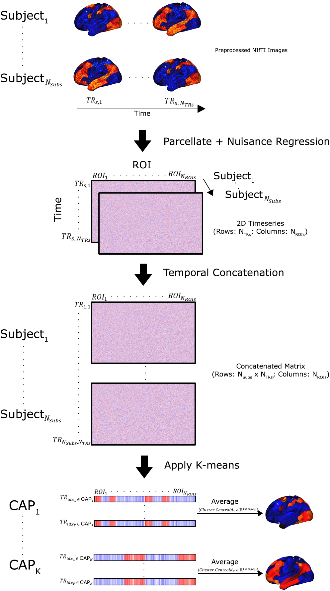

# NeuroCAPs: Neuroimaging Co-Activation Patterns

[](https://pypi.python.org/pypi/neurocaps/)
[](https://pypi.python.org/pypi/neurocaps/)
[](https://doi.org/10.5281/zenodo.15867457)
[](https://github.com/donishadsmith/neurocaps)
[](https://github.com/donishadsmith/neurocaps/actions/workflows/testing.yaml)
[](http://neurocaps.readthedocs.io/en/stable/?badge=stable)
[](https://codecov.io/github/donishadsmith/neurocaps)
[](https://github.com/psf/black)
[](https://opensource.org/licenses/MIT)

[](https://hub.docker.com/r/donishadsmith/neurocaps/tags/)
[](https://joss.theoj.org/papers/0e5c44d5d82402fa0f28e6a8833428f0)

NeuroCAPs (**Neuro**imaging **C**o-**A**ctivation **P**attern**s**) is a Python package for performing Co-Activation
Patterns (CAPs) analyses on resting-state or task-based fMRI data. CAPs identifies recurring brain states by applying
k-means clustering on BOLD timeseries data [^1].



## Installation
**NeuroCAPs requires Python 3.9-3.12.**

To install NeuroCAPs, follow the instructions below using your preferred terminal.

### Standard Installation from PyPi
```bash

pip install neurocaps

```

#### Windows Users
PyBIDS will not be installed by default due to installation errors that may occur if long paths
aren't enabled (Refer to official [Microsoft documentation](https://learn.microsoft.com/en-us/windows/win32/fileio/maximum-file-path-limitation?tabs=powershell)
to enable this feature).

To include PyBIDS in your installation, use:

```bash

pip install neurocaps[windows]

```

Alternatively, you can install PyBIDS separately:

```bash

pip install pybids

```
### Installation from Source (Development Version)
To install the latest development version from the source, there are two options:

1. Install directly via pip:
```bash

pip install git+https://github.com/donishadsmith/neurocaps.git

```

2. Clone the repository and install locally:

```bash

git clone --depth 1 https://github.com/donishadsmith/neurocaps/
cd neurocaps
pip install -e .
# Clone with submodules to include test dataset ~140 MB
git submodule update --init

```

#### Windows Users
To include PyBIDS when installing the development version on Windows, use:

```bash

git clone --depth 1 https://github.com/donishadsmith/neurocaps/
cd neurocaps
pip install -e .[windows]
# Clone with submodules to include test dataset ~140 MB
git submodule update --init
```

## Docker
If [Docker](https://docs.docker.com/) is available on your system, you can use the NeuroCAPs Docker
image, which includes the demos and configures a headless display for VTK.

To pull the Docker image:
```bash

docker pull donishadsmith/neurocaps && docker tag donishadsmith/neurocaps neurocaps
```

The image can be run as:

1. An interactive bash session (default):

```bash

docker run -it neurocaps
```

2. A Jupyter Notebook with port forwarding:

```bash

docker run -it -p 9999:9999 neurocaps notebook
```

## Features
NeuroCAPs is built around two main classes (``TimeseriesExtractor`` and ``CAP``) and includes several
features to perform the complete CAPs workflow from postprocessing to visualizations.
Notable features includes:

- Timeseries Extraction (``TimeseriesExtractor``):
    - extracts BOLD timeseries from resting-state or task-based fMRI data
    - supports deterministic parcellations such as the Schaefer and AAL, in addition to custom-defined deterministic parcellations
    - performs nuisance regression, motion scrubbing, and additional features
    - reports quality control information based on framewise displacement

    **Important**:
       NeuroCAPs is most optimized for fMRI data preprocessed with
       [fMRIPrep](https://fmriprep.org/en/stable/) and assumes the data is BIDs compliant.
       Refer to [NeuroCAPs' BIDS Structure and Entities Documentation](https://neurocaps.readthedocs.io/en/stable/bids.html)
       for additional information.

- CAPs Analysis (``CAP``):
    - performs k-means clustering on individuals or groups
    - identifies the optimal number of clusters using Silhouette, Elbow, Davies Bouldin, or Variance Ratio methods
    - computes several temporal dynamic metrics [^2] [^3]:
        - temporal fraction (fraction of time)
        - persistence (dwell time)
        - counts (state initiation)
        - transition frequency & probability
    - produces several visualizations:
        - heatmaps and outer product plots
        - surface plots
        - correlation matrices
        - cosine similarity radar plots [^4] [^5]

- Utilities:
  - plot transition matrices
  - merges timeseries data across tasks or session
  - generates the custom parcellation dictionary structure from the parcellation's metadata file
  - fetches preset custom parcellation approaches

Full details for every function and parameter are available in the
[API Documentation](https://neurocaps.readthedocs.io/en/stable/api.html).

## Workflow
The following code demonstrates a high-level workflow overview using NeuroCAPs to perform the CAPs
analysis. An interactive variant of this workflow is available on the
[readthedocs](https://neurocaps.readthedocs.io/en/stable/examples/workflow.html). Additional
[tutorials]([demos](https://github.com/donishadsmith/neurocaps/tree/main/demos)) and
[interactive demonstrations](https://github.com/donishadsmith/neurocaps/tree/main/demos) are
also provided.

1. Extract timeseries data
```python
from neurocaps.extraction import TimeseriesExtractor

# Using Schaefer, one of the default parcellation approaches
parcel_approach = {"Schaefer": {"n_rois": 100, "yeo_networks": 7}}

# List of fMRIPrep-derived confounds for nuisance regression
confound_names = [
    "cosine*",
    "trans_x",
    "trans_x_derivative1",
    "trans_y",
    "trans_y_derivative1",
    "trans_z",
    "trans_z_derivative1",
    "rot_x",
    "rot_x_derivative1",
    "rot_y",
    "rot_y_derivative1",
    "rot_z",
    "rot_z_derivative1",
    "a_comp_cor_00",
    "a_comp_cor_01",
    "a_comp_cor_02",
    "a_comp_cor_03",
    "a_comp_cor_04",
]

# Initialize extractor with signal cleaning parameters
extractor = TimeseriesExtractor(
    space="MNI152NLin2009cAsym",
    parcel_approach=parcel_approach,
    confound_names=confound_names,
    standardize=False,
    fd_threshold={
        "threshold": 0.50,
        "outlier_percentage": 0.30,
    },
)

# Extract BOLD data from preprocessed fMRIPrep data
# which should be located in the "derivatives" folder
# within the BIDS root directory
# The extracted timeseries data is automatically stored
extractor.get_bold(
    bids_dir="path/to/bids/root",
    pipeline_name="fmriprep",
    session="1",
    task="rest",
    tr=2,
    verbose=False,
)

# Retrieve the dataframe containing QC information for each subject
# to use for downstream statistical analyses
qc_df = extractor.report_qc()
print(qc_df)
```

2. Use k-means clustering to identify the optimal number of CAPs from the data using a heuristic
```python
from neurocaps.analysis import CAP

# Initialize CAP class
cap_analysis = CAP(parcel_approach=extractor.parcel_approach)

# Identify the optimal number of CAPs (clusters)
# using the elbow method to test 2-20
# The optimal number of CAPs is automatically stored
cap_analysis.get_caps(
    subject_timeseries=extractor.subject_timeseries,
    n_clusters=range(2, 21),
    standardize=True,
    cluster_selection_method="elbow",
    max_iter=500,
    n_init=10,
    random_state=0,
)
```

3. Compute temporal dynamic metrics for downstream statistical analyses
```python
# Calculate temporal fraction of each CAP for all subjects
output = cap_analysis.calculate_metrics(extractor.subject_timeseries, metrics=["temporal_fraction"])
print(output["temporal_fraction"])
```

4. Visualize CAPs
```python
# Project CAPs onto surface plots  and generate cosine similarity network alignment of CAPs
cap_analysis.caps2surf().caps2radar()
```

## Acknowledgements
NeuroCAPs relies on several popular data processing, machine learning, neuroimaging, and visualization
[packages](https://neurocaps.readthedocs.io/en/stable/#dependencies).

Additionally, some foundational concepts in this package take inspiration from features or design
patterns implemented in other neuroimaging Python packages, specically:

- mtorabi59's [pydfc](https://github.com/neurodatascience/dFC), a toolbox that allows comparisons
among several popular dynamic functionality methods.
- 62442katieb's [IDConn](https://github.com/62442katieb/IDConn), a pipeline for assessing individual
differences in resting-state or task-based functional connectivity.

## Reporting Issues
Bug reports, feature requests, and documentation enhancements can be reported using the
templates offered when creating a new issue in the
[issue tracker](https://github.com/donishadsmith/neurocaps/issues).

## Contributing
Please refer the [contributing guidelines](https://neurocaps.readthedocs.io/en/stable/contributing.html)
on how to contribute to NeuroCAPs.

## References
[^1]: Liu, X., Chang, C., & Duyn, J. H. (2013). Decomposition of spontaneous brain activity into
distinct fMRI co-activation patterns. Frontiers in Systems Neuroscience, 7.
https://doi.org/10.3389/fnsys.2013.00101

[^2]: Liu, X., Zhang, N., Chang, C., & Duyn, J. H. (2018). Co-activation patterns in resting-state
fMRI signals. NeuroImage, 180, 485–494. https://doi.org/10.1016/j.neuroimage.2018.01.041

[^3]: Yang, H., Zhang, H., Di, X., Wang, S., Meng, C., Tian, L., & Biswal, B. (2021). Reproducible
coactivation patterns of functional brain networks reveal the aberrant dynamic state transition in
schizophrenia. NeuroImage, 237, 118193. https://doi.org/10.1016/j.neuroimage.2021.118193

[^4]: Zhang, R., Yan, W., Manza, P., Shokri-Kojori, E., Demiral, S. B., Schwandt, M., Vines, L.,
Sotelo, D., Tomasi, D., Giddens, N. T., Wang, G., Diazgranados, N., Momenan, R., & Volkow, N. D. (2023).
Disrupted brain state dynamics in opioid and alcohol use disorder: attenuation by nicotine use.
Neuropsychopharmacology, 49(5), 876–884. https://doi.org/10.1038/s41386-023-01750-w

[^5]: Ingwersen, T., Mayer, C., Petersen, M., Frey, B. M., Fiehler, J., Hanning, U., Kühn, S.,
Gallinat, J., Twerenbold, R., Gerloff, C., Cheng, B., Thomalla, G., & Schlemm, E. (2024).
Functional MRI brain state occupancy in the presence of cerebral small vessel disease —
A pre-registered replication analysis of the Hamburg City Health Study. Imaging Neuroscience,
2, 1–17. https://doi.org/10.1162/imag_a_00122

[^6]: Kupis, L., Romero, C., Dirks, B., Hoang, S., Parladé, M. V., Beaumont, A. L., Cardona, S. M.,
Alessandri, M., Chang, C., Nomi, J. S., & Uddin, L. Q. (2020). Evoked and intrinsic brain network
dynamics in children with autism spectrum disorder. NeuroImage: Clinical, 28, 102396.
https://doi.org/10.1016/j.nicl.2020.102396

[^7]: Hyunwoo Gu and Joonwon Lee and Sungje Kim and Jaeseob Lim and Hyang-Jung Lee and Heeseung Lee
and Minjin Choe and Dong-Gyu Yoo and Jun Hwan (Joshua) Ryu and Sukbin Lim and Sang-Hun Lee (2024).
Discrimination-Estimation Task. OpenNeuro. [Dataset] doi: https://doi.org/10.18112/openneuro.ds005381.v1.0.0
