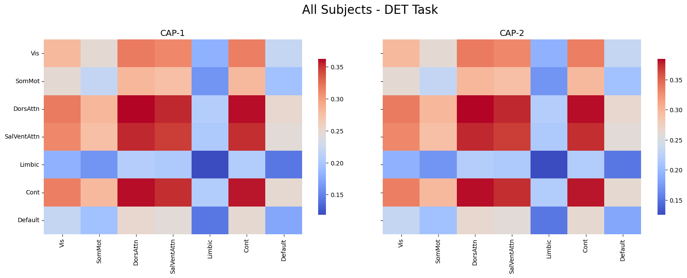
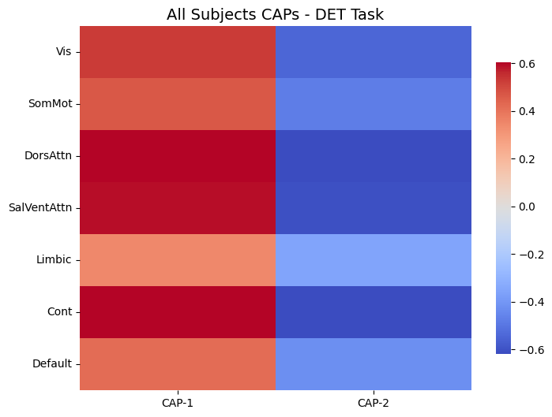
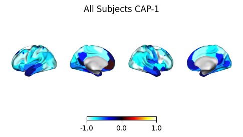
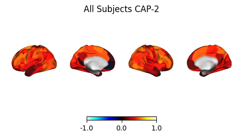
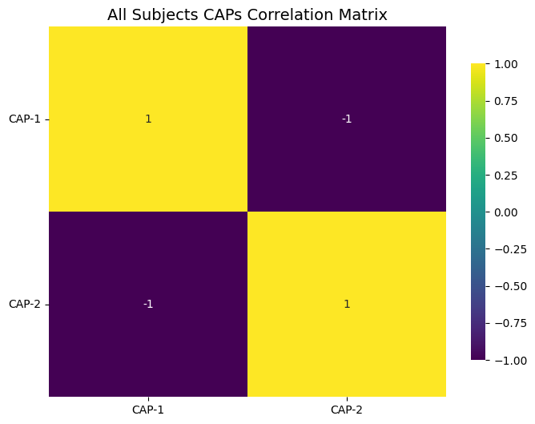
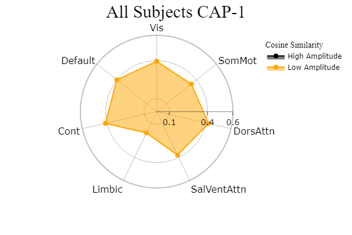
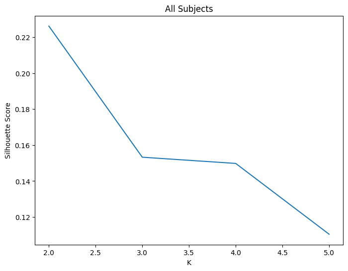
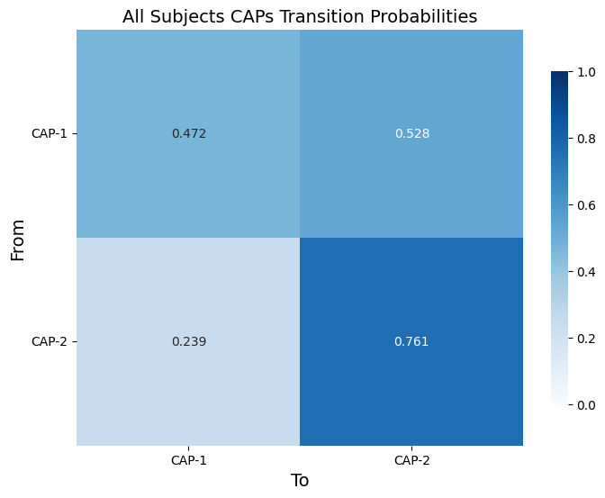

# NeuroCAPs: Neuroimaging Co-Activation Patterns

[](https://pypi.python.org/pypi/neurocaps/)
[](https://pypi.python.org/pypi/neurocaps/)
[](https://doi.org/10.5281/zenodo.15837891)
[](https://github.com/donishadsmith/neurocaps)
[](https://github.com/donishadsmith/neurocaps/actions/workflows/testing.yaml)
[](http://neurocaps.readthedocs.io/en/stable/?badge=stable)
[](https://codecov.io/github/donishadsmith/neurocaps)
[](https://github.com/psf/black)
[](https://opensource.org/licenses/MIT)

[](https://hub.docker.com/r/donishadsmith/neurocaps/tags/)
[](https://joss.theoj.org/papers/0e5c44d5d82402fa0f28e6a8833428f0)

NeuroCAPs (**Neuro**imaging **C**o-**A**ctivation **P**attern**s**) is a Python package for performing Co-Activation
Patterns (CAPs) analyses on resting-state or task-based fMRI data. CAPs identifies recurring brain states by applying
k-means clustering on BOLD timeseries data [^1].


## Installation
**NeuroCAPs requires Python 3.9-3.12.**

To install NeuroCAPs, follow the instructions below using your preferred terminal.

### Standard Installation from PyPi
```bash

pip install neurocaps

```

**Windows Users**

To avoid installation errors related to long paths not being enabled, PyBIDS will not be installed by default.
Refer to official [Microsoft documentation](https://learn.microsoft.com/en-us/windows/win32/fileio/maximum-file-path-limitation?tabs=powershell)
to enable long paths.

To include PyBIDS in your installation, use:

```bash

pip install neurocaps[windows]

```

Alternatively, you can install PyBIDS separately:

```bash

pip install pybids

```
### Installation from Source (Development Version)
To install the latest development version from the source, there are two options:

1. Install directly via pip:
```bash

pip install git+https://github.com/donishadsmith/neurocaps.git

```

2. Clone the repository and install locally:

```bash

git clone --depth 1 https://github.com/donishadsmith/neurocaps/
cd neurocaps
pip install -e .
# Clone with submodules to include test dataset ~140 MB
git submodule update --init

```
**Windows Users**

To include PyBIDS when installing the development version on Windows, use:

```bash

git clone --depth 1 https://github.com/donishadsmith/neurocaps/
cd neurocaps
pip install -e .[windows]
# Clone with submodules to include test dataset ~140 MB
git submodule update --init
```

## Docker

If [Docker](https://docs.docker.com/) is available on your system, you can use the NeuroCAPs Docker
image, which includes the demos and configures a headless display for VTK.

To pull the Docker image:
```bash

docker pull donishadsmith/neurocaps && docker tag donishadsmith/neurocaps neurocaps
```

The image can be run as:

1. An interactive bash session (default):

```bash

docker run -it neurocaps
```

2. A Jupyter Notebook with port forwarding:

```bash

docker run -it -p 9999:9999 neurocaps notebook
```

## Usage
NeuroCAPs is built around two main classes (``TimeseriesExtractor`` and ``CAP``) and includes several
features to perform the complete CAPs workflow from postprocessing to visualizations.
Notable features includes:

- Timeseries Extraction (``TimeseriesExtractor``):
    - extracts BOLD timeseries from resting-state or task-based fMRI data
    - supports deterministic parcellations such as the Schaefer and AAL, in addition to custom-defined deterministic parcellations
    - performs nuisance regression, motion scrubbing, and additional features
    - reports quality control information based on framewise displacement

    **Important**:
       NeuroCAPs is most optimized for fMRI data preprocessed with
       [fMRIPrep](https://fmriprep.org/en/stable/) and assumes the data is BIDs compliant.
       Refer to [NeuroCAPs' BIDS Structure and Entities Documentation](https://neurocaps.readthedocs.io/en/stable/bids.html)
       for additional information.

- CAP Analysis (``CAP``):
    - performs k-means clustering on individuals or groups
    - identifies the optimal number of clusters using Silhouette, Elbow, Davies Bouldin, or Variance Ratio methods
    - computes several temporal dynamic metrics [^2] [^3]:
        - temporal fraction (fraction of time)
        - persistence (dwell time)
        - counts (state initiation)
        - transition frequency & probability
    - produces several visualizations:
        - heatmaps and outer product plots
        - surface plots
        - correlation matrices
        - cosine similarity radar plots [^4] [^5]

- Utilities:
  - plot transition matrices
  - merges timeseries data across tasks or session
  - generates the custom parcellation dictionary structure from the parcellation's metadata file
  - fetches preset custom parcellation approaches

Full details for every function and parameter are available in the
[API Documentation](https://neurocaps.readthedocs.io/en/stable/api.html).

## Demonstration

Use dataset from OpenNeuro [^7]:
```python
# Download Sample Dataset from OpenNeuro, requires the openneuro-py package
# [Dataset] doi: doi:10.18112/openneuro.ds005381.v1.0.0
import os
from openneuro import download

demo_dir = "neurocaps_demo"
os.makedirs(demo_dir)

# Include the run-1 and run-2 data from two tasks for two subjects
include = [
    "dataset_description.json",
    "sub-0004/ses-2/func/*run-[12]*events*",
    "sub-0006/ses-2/func/*run-[12]*events*",
    "derivatives/fmriprep/sub-0004/fmriprep/sub-0004/ses-2/func/*run-[12]*confounds_timeseries*",
    "derivatives/fmriprep/sub-0004/fmriprep/sub-0004/ses-2/func/*run-[12]_space-MNI152NLin*preproc_bold*",
    "derivatives/fmriprep/sub-0006/fmriprep/sub-0006/ses-2/func/*run-[12]*confounds_timeseries*",
    "derivatives/fmriprep/sub-0006/fmriprep/sub-0006/ses-2/func/*run-[12]_space-MNI152NLin*preproc_bold*",
]

download(dataset="ds005381", include=include, target_dir=demo_dir, verify_hash=False)

# Create a "dataset_description" file for the pipeline folder if needed
import json

desc = {
    "Name": "fMRIPrep - fMRI PREProcessing workflow",
    "BIDSVersion": "1.0.0",
    "DatasetType": "derivative",
    "GeneratedBy": [
        {
            "Name": "fMRIPrep",
            "Version": "20.2.0",
            "CodeURL": "https://github.com/nipreps/fmriprep",
        }
    ],
}

with open(
    "neurocaps_demo/derivatives/fmriprep/dataset_description.json",
    "w",
    encoding="utf-8",
) as f:
    json.dump(desc, f)
```

```python
from neurocaps.extraction import TimeseriesExtractor
from neurocaps.analysis import CAP

# Set specific confounds for nuisance regression
confounds = [
    "cosine*",
    "trans_x",
    "trans_y",
    "trans_z",
    "rot_x",
    "rot_y",
    "rot_z",
]

# Set parcellation
parcel_approach = {"Schaefer": {"n_rois": 100, "yeo_networks": 7, "resolution_mm": 2}}

# Initialize TimeseriesExtractor
extractor = TimeseriesExtractor(
    space="MNI152NLin6Asym",
    parcel_approach=parcel_approach,
    standardize=True,
    use_confounds=True,
    detrend=False,
    low_pass=0.1,
    high_pass=None,
    n_acompcor_separate=2,
    confound_names=confounds,
    fd_threshold={
        "threshold": 0.35,
        "outlier_percentage": 0.20,
        "n_before": 2,
        "n_after": 1,
        "use_sample_mask": True,
    },
)

# Extracting timeseries from the DET task (specifically for the "late" condition) for subjects in the BIDS directory
# Subject 0006 run-1 will be flagged and skipped
# Then saving the extracted timeseries data by chaining operations
extractor.get_bold(
    bids_dir="neurocaps_demo",
    pipeline_name="fmriprep",
    task="DET",
    condition="late",
    condition_tr_shift=2,
    slice_time_ref=1,
    session="2",
    n_cores=None,
    verbose=True,
    progress_bar=False,
).timeseries_to_pickle("neurocaps_demo", "timeseries.pkl")
```
<details>
<summary>Logs</summary>

```
2025-07-03 14:22:51,986 neurocaps.extraction._internals.confounds [INFO] Confound regressors to be used if available: cosine*, trans_x, trans_y, trans_z, rot_x, rot_y, rot_z.
2025-07-03 14:22:54,335 neurocaps.extraction.timeseries_extractor [INFO] BIDS Layout: ...ithub\neurocaps\neurocaps_demo | Subjects: 2 | Sessions: 2 | Runs: 4
2025-07-03 14:22:54,636 neurocaps.extraction._internals.postprocess [INFO] [SUBJECT: 0004 | SESSION: 2 | TASK: DET | RUN: 1] Preparing for Timeseries Extraction using [FILE: sub-0004_ses-2_task-DET_run-1_space-MNI152NLin6Asym_res-2_desc-preproc_bold.nii.gz].
2025-07-03 14:22:54,667 neurocaps.extraction._internals.postprocess [INFO] [SUBJECT: 0004 | SESSION: 2 | TASK: DET | RUN: 1] The following confounds will be used for nuisance regression: cosine00, cosine01, cosine02, cosine03, trans_x, trans_y, trans_z, rot_x, rot_y, rot_z, a_comp_cor_00, a_comp_cor_01, a_comp_cor_33, a_comp_cor_34.
2025-07-03 14:23:12,248 neurocaps.extraction._internals.postprocess [INFO] [SUBJECT: 0004 | SESSION: 2 | TASK: DET | RUN: 1] Nuisance regression completed; extracting [CONDITION: late].
2025-07-03 14:23:12,298 neurocaps.extraction._internals.postprocess [INFO] [SUBJECT: 0004 | SESSION: 2 | TASK: DET | RUN: 2] Preparing for Timeseries Extraction using [FILE: sub-0004_ses-2_task-DET_run-2_space-MNI152NLin6Asym_res-2_desc-preproc_bold.nii.gz].
2025-07-03 14:23:12,349 neurocaps.extraction._internals.postprocess [INFO] [SUBJECT: 0004 | SESSION: 2 | TASK: DET | RUN: 2] The following confounds will be used for nuisance regression: cosine00, cosine01, cosine02, cosine03, trans_x, trans_y, trans_z, rot_x, rot_y, rot_z, a_comp_cor_00, a_comp_cor_01, a_comp_cor_100, a_comp_cor_101.
2025-07-03 14:23:30,834 neurocaps.extraction._internals.postprocess [INFO] [SUBJECT: 0004 | SESSION: 2 | TASK: DET | RUN: 2] Nuisance regression completed; extracting [CONDITION: late].
2025-07-03 14:23:30,875 neurocaps.extraction._internals.postprocess [INFO] [SUBJECT: 0006 | SESSION: 2 | TASK: DET | RUN: 1] Preparing for Timeseries Extraction using [FILE: sub-0006_ses-2_task-DET_run-1_space-MNI152NLin6Asym_res-2_desc-preproc_bold.nii.gz].
2025-07-03 14:23:30,915 neurocaps.extraction._internals.postprocess [WARNING] [SUBJECT: 0006 | SESSION: 2 | TASK: DET | RUN: 1] Timeseries Extraction Skipped: Run flagged due to more than 20.0% of the volumes exceeding the framewise displacement threshold of 0.35. Percentage of volumes exceeding the threshold limit is 21.62162162162162% for [CONDITION: late].
2025-07-03 14:23:30,917 neurocaps.extraction._internals.postprocess [INFO] [SUBJECT: 0006 | SESSION: 2 | TASK: DET | RUN: 2] Preparing for Timeseries Extraction using [FILE: sub-0006_ses-2_task-DET_run-2_space-MNI152NLin6Asym_res-2_desc-preproc_bold.nii.gz].
2025-07-03 14:23:30,952 neurocaps.extraction._internals.postprocess [INFO] [SUBJECT: 0006 | SESSION: 2 | TASK: DET | RUN: 2] The following confounds will be used for nuisance regression: cosine00, cosine01, cosine02, cosine03, trans_x, trans_y, trans_z, rot_x, rot_y, rot_z, a_comp_cor_00, a_comp_cor_01, a_comp_cor_24, a_comp_cor_25.
2025-07-03 14:23:46,605 neurocaps.extraction._internals.postprocess [INFO] [SUBJECT: 0006 | SESSION: 2 | TASK: DET | RUN: 2] Nuisance regression completed; extracting [CONDITION: late].
```

</details>

**Note:** Refer to [NeuroCAPs' Logging Documentation](https://neurocaps.readthedocs.io/en/stable/logging.html) for
additional information about configuring logging.

```python
# Get QC report
# Only censored frames with valid data on both sides are interpolated, while censored frames at the edge of the
# timeseries (including frames that border censored edges) are always scrubbed and counted in "Frames_Scrubbed"
df = extractor.report_qc()

# Note run-2 for subject 006 is not in QC report due to being flagged
# Also, when condition is specified, the QC report is specific to the condition
print(df)
```
**DataFrame Output:**
| Subject_ID | Run | Mean_FD | Std_FD | Frames_Scrubbed | Frames_Interpolated | Mean_High_Motion_Length | Std_High_Motion_Length | N_Dummy_Scans |
| --- | --- | --- | --- | --- | --- | --- | --- | --- |
| 0004 | run-1 | 0.101492 | 0.056535 | 2 | 0 | 2.0 | 0.0 | NaN |
| 0004 | run-2 | 0.103347 | 0.073092 | 0 | 0 | 0.0 | 0.0 | NaN |
| 0006 | run-2 | 0.160510 | 0.084528 | 2 | 0 | 1.0 | 0.0 | NaN |


```python
# Initialize CAP class
cap_analysis = CAP(parcel_approach=extractor.parcel_approach)

# Pickle files can also be used as input for `subject_timeseries`
# Only using 2 clusters for simplicity
cap_analysis.get_caps(
    subject_timeseries=extractor.subject_timeseries,
    n_clusters=2,
    standardize=True,
)

# `sharey` only applicable to outer product plots
kwargs = {
    "sharey": True,
    "ncol": 3,
    "subplots": True,
    "cmap": "coolwarm",
    "xticklabels_size": 10,
    "yticklabels_size": 10,
    "xlabel_rotation": 90,
    "cbarlabels_size": 10,
}

# Outer Product
cap_analysis.caps2plot(
    visual_scope="regions", plot_options=["outer_product"], suffix_title="DET Task - late", **kwargs
)

# Heatmap
kwargs["xlabel_rotation"] = 0

cap_analysis.caps2plot(
    visual_scope="regions", plot_options=["heatmap"], suffix_title="DET Task - late", **kwargs
)
```
<details>
<summary>Logs</summary>

```
2025-07-03 18:00:20,925 neurocaps.analysis.cap._internals.cluster [INFO] No groups specified. Using default group 'All Subjects' containing all subject IDs from `subject_timeseries`. The `self.groups` dictionary will remain fixed unless the `CAP` class is re-initialized or `self.clear_groups()` is used.
```

</details>

**Plot Outputs:**




```python
# Get CAP metrics and using `tr` to convert persistence from TR units to seconds
outputs = cap_analysis.calculate_metrics(
    subject_timeseries=extractor.subject_timeseries,
    tr=2.0,
    return_df=True,
    metrics=["temporal_fraction", "persistence"],
    continuous_runs=True,
    progress_bar=False,
)

# Subject 0006 only has run-2 data since run-1 was flagged during timeseries extraction
print(outputs["temporal_fraction"])
```
**DataFrame Output:**
| Subject_ID | Group | Run | CAP-1 | CAP-2 |
| --- | --- | --- | --- | --- |
| 0004 | All Subjects | run-continuous | 0.672131 | 0.327869 |
| 0006 | All Subjects | run-2 | 0.566667 | 0.433333 |

```python
# Create surface plots
kwargs = {
    "cmap": "cold_hot",
    "layout": "row",
    "size": (500, 200),
    "zoom": 1,
    "cbar_kws": {"location": "bottom"},
    "color_range": (-1, 1),
}

cap_analysis.caps2surf(progress_bar=False, **kwargs)
```
**Plot Outputs:**




```python
# Create Pearson correlation matrix
kwargs = {
    "annot": True,
    "cmap": "viridis",
    "xticklabels_size": 10,
    "yticklabels_size": 10,
    "cbarlabels_size": 10,
}

cap_analysis.caps2corr(**kwargs)
```
**Plot Output:**



```python
# Create radar plots showing cosine similarity between region/networks and caps
radialaxis = {
    "showline": True,
    "linewidth": 2,
    "linecolor": "rgba(0, 0, 0, 0.25)",
    "gridcolor": "rgba(0, 0, 0, 0.25)",
    "ticks": "outside",
    "tickfont": {"size": 14, "color": "black"},
    "range": [0, 0.6],
    "tickvals": [0.1, "", "", 0.4, "", "", 0.6],
}

legend = {
    "yanchor": "top",
    "y": 0.99,
    "x": 0.99,
    "title_font_family": "Times New Roman",
    "font": {"size": 12, "color": "black"},
}

colors = {"High Amplitude": "black", "Low Amplitude": "orange"}

kwargs = {
    "radialaxis": radialaxis,
    "fill": "toself",
    "legend": legend,
    "color_discrete_map": colors,
    "height": 400,
    "width": 600,
}

cap_analysis.caps2radar(**kwargs)
```
**Plot Outputs:**




```python
# Get transition probabilities for all participants in a dataframe
from neurocaps.analysis import transition_matrix

# Optimal cluster sizes are saved automatically
cap_analysis.get_caps(
    subject_timeseries=extractor.subject_timeseries,
    cluster_selection_method="silhouette",
    standardize=True,
    show_figs=True,
    n_clusters=range(2, 6),
    progress_bar=True,
)

outputs = cap_analysis.calculate_metrics(
    subject_timeseries=extractor.subject_timeseries,
    return_df=True,
    metrics=["transition_probability"],
    continuous_runs=True,
    progress_bar=False,
)

print(outputs["transition_probability"]["All Subjects"])

kwargs = {
    "cmap": "Blues",
    "fmt": ".3f",
    "annot": True,
    "vmin": 0,
    "vmax": 1,
    "xticklabels_size": 10,
    "yticklabels_size": 10,
    "cbarlabels_size": 10,
}

# Creating an averaged transition matrix from the sub-level transition proabilities
trans_outputs = transition_matrix(
    trans_dict=outputs["transition_probability"], show_figs=True, return_df=True, **kwargs
)

print(trans_outputs["All Subjects"])
```

<details>
<summary>Logs</summary>

```
Collecting Subject Timeseries Data [GROUP: All Subjects]: 100%|█████████████████████████████████████████████████████████████████████████████████████████████████████████████████████| 2/2 [00:00<00:00, 235.58it/s]
Concatenating Timeseries Data Per Group: 100%|█████████████████████████████████████████████████████████████████████████████████████████████████████████████████████| 1/1 [00:00<00:00, 183.45it/s]
Clustering [GROUP: All Subjects]: 100%|█████████████████████████████████████████████████████████████████████████████████████████████████████████████████████| 4/4 [00:00<00:00, 6.02it/s]
2025-07-03 18:07:48,004 neurocaps.analysis.cap._internals.cluster [INFO] [GROUP: All Subjects | METHOD: silhouette] Optimal cluster size is 2.
```
</details>



| Subject_ID | Group | Run | 1.1 | 1.2 | 2.1 | 2.2 |
| --- | --- | --- | --- | --- | --- | --- |
| 0004 | All Subjects | run-continuous | 0.454545 | 0.545455 | 0.289474 | 0.710526 |
| 0006 | All Subjects | run-2 | 0.764706 | 0.235294 | 0.250000 |  0.750000 |



| From/To | CAP-1 | CAP-2 |
| --- | --- | --- |
| CAP-1 | 0.609626 | 0.390374 |
| CAP-2 | 0.269737 | 0.730263 |


Refer to the demos to the [demos](https://github.com/donishadsmith/neurocaps/tree/main/demos) or
[tutorials](https://neurocaps.readthedocs.io/en/latest/examples/examples.html) for an
extensive demonstration of the features included in this package.

## Acknowledgements
NeuroCAPs relies on several popular data processing, machine learning, neuroimaging, and visualization
[packages](https://neurocaps.readthedocs.io/en/stable/#dependencies).

Additionally, some foundational concepts in this package take inspiration from features or design
patterns implemented in other neuroimaging Python packages, specically:

- mtorabi59's [pydfc](https://github.com/neurodatascience/dFC), a toolbox that allows comparisons
among several popular dynamic functionality methods.
- 62442katieb's [IDConn](https://github.com/62442katieb/IDConn), a pipeline for assessing individual
differences in resting-state or task-based functional connectivity.

## Reporting Issues
Bug reports, feature requests, and documentation enhancements can be reported using the
templates offered when creating a new issue in the
[issue tracker](https://github.com/donishadsmith/neurocaps/issues).

## Contributing
Please refer the [contributing guidelines](https://neurocaps.readthedocs.io/en/stable/contributing.html)
on how to contribute to NeuroCAPs.

## References
[^1]: Liu, X., Chang, C., & Duyn, J. H. (2013). Decomposition of spontaneous brain activity into
distinct fMRI co-activation patterns. Frontiers in Systems Neuroscience, 7.
https://doi.org/10.3389/fnsys.2013.00101

[^2]: Liu, X., Zhang, N., Chang, C., & Duyn, J. H. (2018). Co-activation patterns in resting-state
fMRI signals. NeuroImage, 180, 485–494. https://doi.org/10.1016/j.neuroimage.2018.01.041

[^3]: Yang, H., Zhang, H., Di, X., Wang, S., Meng, C., Tian, L., & Biswal, B. (2021). Reproducible
coactivation patterns of functional brain networks reveal the aberrant dynamic state transition in
schizophrenia. NeuroImage, 237, 118193. https://doi.org/10.1016/j.neuroimage.2021.118193

[^4]: Zhang, R., Yan, W., Manza, P., Shokri-Kojori, E., Demiral, S. B., Schwandt, M., Vines, L.,
Sotelo, D., Tomasi, D., Giddens, N. T., Wang, G., Diazgranados, N., Momenan, R., & Volkow, N. D. (2023).
Disrupted brain state dynamics in opioid and alcohol use disorder: attenuation by nicotine use.
Neuropsychopharmacology, 49(5), 876–884. https://doi.org/10.1038/s41386-023-01750-w

[^5]: Ingwersen, T., Mayer, C., Petersen, M., Frey, B. M., Fiehler, J., Hanning, U., Kühn, S.,
Gallinat, J., Twerenbold, R., Gerloff, C., Cheng, B., Thomalla, G., & Schlemm, E. (2024).
Functional MRI brain state occupancy in the presence of cerebral small vessel disease —
A pre-registered replication analysis of the Hamburg City Health Study. Imaging Neuroscience,
2, 1–17. https://doi.org/10.1162/imag_a_00122

[^6]: Kupis, L., Romero, C., Dirks, B., Hoang, S., Parladé, M. V., Beaumont, A. L., Cardona, S. M.,
Alessandri, M., Chang, C., Nomi, J. S., & Uddin, L. Q. (2020). Evoked and intrinsic brain network
dynamics in children with autism spectrum disorder. NeuroImage: Clinical, 28, 102396.
https://doi.org/10.1016/j.nicl.2020.102396

[^7]: Hyunwoo Gu and Joonwon Lee and Sungje Kim and Jaeseob Lim and Hyang-Jung Lee and Heeseung Lee
and Minjin Choe and Dong-Gyu Yoo and Jun Hwan (Joshua) Ryu and Sukbin Lim and Sang-Hun Lee (2024).
Discrimination-Estimation Task. OpenNeuro. [Dataset] doi: https://doi.org/10.18112/openneuro.ds005381.v1.0.0
