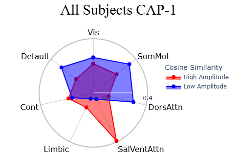
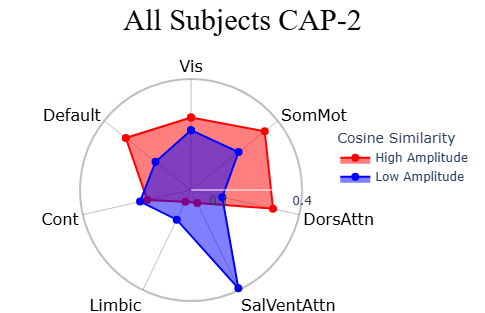

# NeuroCAPs: Neuroimaging Co-Activation Patterns

[](https://pypi.python.org/pypi/neurocaps/)
[](https://pypi.python.org/pypi/neurocaps/)
[](https://doi.org/10.5281/zenodo.16430050)
[](https://github.com/donishadsmith/neurocaps)
[](https://github.com/donishadsmith/neurocaps/actions/workflows/testing.yaml)
[](http://neurocaps.readthedocs.io/en/stable/?badge=stable)
[](https://codecov.io/github/donishadsmith/neurocaps)
[](https://github.com/psf/black)
[](https://opensource.org/licenses/MIT)

[](https://hub.docker.com/r/donishadsmith/neurocaps/tags/)
[](https://joss.theoj.org/papers/0e5c44d5d82402fa0f28e6a8833428f0)

NeuroCAPs (**Neuro**imaging **C**o-**A**ctivation **P**attern**s**) is a Python package for performing Co-Activation
Patterns (CAPs) analyses on resting-state or task-based fMRI data. CAPs identifies recurring brain states by applying
k-means clustering on BOLD timeseries data [^1].


## Installation
**Requires Python 3.9-3.12.**

### Standard Installation
```bash
pip install neurocaps
```

**Windows Users**: Enable [long paths](https://learn.microsoft.com/en-us/windows/win32/fileio/maximum-file-path-limitation?tabs=powershell)
and use:

```bash
pip install neurocaps[windows]
```

### Development Version

```bash
git clone https://github.com/donishadsmith/neurocaps/
cd neurocaps
pip install -e .

# For windows
# pip install -e .[windows]

# Clone with submodules to include test data ~140 MB
git submodule update --init
```

## Docker
A [Docker](https://docs.docker.com/) image is available with demos and headless VTK display configured:

```bash
# Pull image
docker pull donishadsmith/neurocaps && docker tag donishadsmith/neurocaps neurocaps

# Run interactive bash
docker run -it neurocaps

# Run Jupyter Notebook
docker run -it -p 9999:9999 neurocaps notebook
```

## Features
NeuroCAPs is built around two main classes (``TimeseriesExtractor`` and ``CAP``) and includes several
features to perform the complete CAPs workflow from postprocessing to visualizations.
Notable features includes:

- Timeseries Extraction (``TimeseriesExtractor``):
    - extracts BOLD timeseries from resting-state or task-based fMRI data
    - supports deterministic parcellations such as the Schaefer and AAL, in addition to custom-defined deterministic parcellations
    - performs nuisance regression, motion scrubbing, and additional features
    - reports quality control information based on framewise displacement

    **Important**:
       NeuroCAPs is most optimized for fMRI data preprocessed with
       [fMRIPrep](https://fmriprep.org/en/stable/) and assumes the data is BIDs compliant.
       Refer to [NeuroCAPs' BIDS Structure and Entities Documentation](https://neurocaps.readthedocs.io/en/stable/bids.html)
       for additional information.

- CAPs Analysis (``CAP``):
    - performs k-means clustering on individuals or groups
    - identifies the optimal number of clusters using Silhouette, Elbow, Davies Bouldin, or Variance Ratio methods
    - computes several temporal dynamic metrics [^2] [^3]:
        - temporal fraction (fraction of time)
        - persistence (dwell time)
        - counts (state initiation)
        - transition frequency & probability
    - produces several visualizations:
        - heatmaps and outer product plots
        - surface plots
        - correlation matrices
        - cosine similarity radar plots [^4] [^5]

- Utilities:
  - plot transition matrices
  - merge timeseries data across tasks or session [^6]
  - generate the custom parcellation dictionary structure from the parcellation's metadata file
  - fetch preset custom parcellation approaches

Full details for every function and parameter are available in the
[API Documentation](https://neurocaps.readthedocs.io/en/stable/api.html).

## Quick Start
The following code demonstrates basic usage of NeuroCAPs (with simulated data) to perform CAPs analysis.
A version of this example using real data from [OpenNeuro](https://openneuro.org/)
is available on the [readthedocs](https://neurocaps.readthedocs.io/en/stable/tutorials/tutorial-8.html).
Additional [tutorials]([demos](https://neurocaps.readthedocs.io/en/stable/tutorials/)) and
[interactive demonstrations](https://github.com/donishadsmith/neurocaps/tree/main/demos) are
also available.

1. Extract timeseries data
```python
import numpy as np

from neurocaps.extraction import TimeseriesExtractor
from neurocaps.utils import simulate_bids_dataset

# Set seed
np.random.seed(0)

# Generate a BIDS directory with fMRIPrep derivatives
bids_root = simulate_bids_dataset(n_subs=3, n_runs=1, n_volumes=100, task_name="rest")

# Using Schaefer, one of the default parcellation approaches
parcel_approach = {"Schaefer": {"n_rois": 100, "yeo_networks": 7}}

# List of fMRIPrep-derived confounds for nuisance regression
acompcor_names = [f"a_comp_cor_0{i}" for i in range(5)]
confound_names = ["cosine*", "trans*", "rot*", *acompcor_names]

# Initialize extractor with signal cleaning parameters
extractor = TimeseriesExtractor(
    space="MNI152NLin2009cAsym",
    parcel_approach=parcel_approach,
    confound_names=confound_names,
    standardize=False,
    # Run discarded if more than 30% of volumes exceed FD threshold
    fd_threshold={"threshold": 0.90, "outlier_percentage": 0.30},
)

# Extract preprocessed BOLD data
extractor.get_bold(bids_dir=bids_root, task="rest", tr=2, n_cores=1, verbose=False)

# Check QC information
qc_df = extractor.report_qc()
print(qc_df)
```


2. Use k-means clustering to identify the optimal number of CAPs from the data using a heuristic
```python
from neurocaps.analysis import CAP
from neurocaps.utils import PlotDefaults

# Initialize CAP class
cap_analysis = CAP(parcel_approach=extractor.parcel_approach, groups=None)

plot_kwargs = {**PlotDefaults.get_caps(), "figsize": (4, 3), "step": 2}

# Find optimal CAPs (2-20) using silhouette method; results are stored
cap_analysis.get_caps(
    subject_timeseries=extractor.subject_timeseries,
    n_clusters=range(2, 21),
    standardize=True,
    cluster_selection_method="silhouette",
    max_iter=500,
    n_init=10,
    show_figs=True,
    **plot_kwargs,
)
```


3. Compute temporal dynamic metrics for downstream statistical analyses
```python
# Calculate temporal fraction of each CAP
metric_dict = cap_analysis.calculate_metrics(
    extractor.subject_timeseries, metrics=["temporal_fraction"]
)
print(metric_dict["temporal_fraction"])
```


Note that CAP-1 is the dominant brain state across subjects (highest frequency).

4. Visualize CAPs
```python
# Create surface and radar plots for each CAP
surface_kwargs = {**PlotDefaults.caps2surf(), "layout": "row", "size": (500, 100)}

radar_kwargs = {**PlotDefaults.caps2radar(), "height": 400, "width": 485}
radar_kwargs["radialaxis"] = {"range": [0, 0.4], "tickvals": [0.1, "", "", 0.4]}
radar_kwargs["legend"] = {"yanchor": "top", "y": 0.75, "x": 1.15}

cap_analysis.caps2surf(**surface_kwargs).caps2radar(**radar_kwargs)
```






Radar plots show network alignment (measured by cosine similarity): "High Amplitude" represents
alignment to activations (> 0), "Low Amplitude" represents alignment to deactivations (< 0).

Each CAP can be characterized using either maximum alignment
(CAP-1: Vis+/SomMot-; CAP-2: SomMot+/Vis-) or predominant alignment ("High Amplitude" − "Low Amplitude";
CAP-1: SalVentAttn+/SomMot-; CAP-2: SomMot+/SalVentAttn-).

```python
import pandas as pd

for cap_name in cap_analysis.caps["All Subjects"]:
    df = pd.DataFrame(cap_analysis.cosine_similarity["All Subjects"][cap_name])
    df["Net"] = df["High Amplitude"] - df["Low Amplitude"]
    df["Regions"] = cap_analysis.cosine_similarity["All Subjects"]["Regions"]
    print(f"{cap_name}:", "\n", df, "\n")
```
CAP-1:


CAP-2:


Note: For information about logging, refer to [NeuroCAPs' Logging Guide](https://neurocaps.readthedocs.io/en/stable/user_guide/logging.html).

## Acknowledgements
NeuroCAPs relies on several popular data processing, machine learning, neuroimaging, and visualization
[packages](https://neurocaps.readthedocs.io/en/stable/#dependencies).

Additionally, some foundational concepts in this package take inspiration from features or design
patterns implemented in other neuroimaging Python packages, specically:

- mtorabi59's [pydfc](https://github.com/neurodatascience/dFC), a toolbox that allows comparisons
among several popular dynamic functionality methods.
- 62442katieb's [IDConn](https://github.com/62442katieb/IDConn), a pipeline for assessing individual
differences in resting-state or task-based functional connectivity.

## Reporting Issues
Bug reports, feature requests, and documentation enhancements can be reported using the
templates offered when creating a new issue in the
[issue tracker](https://github.com/donishadsmith/neurocaps/issues).

## Contributing
Please refer the [contributing guidelines](https://neurocaps.readthedocs.io/en/stable/contributing.html)
on how to contribute to NeuroCAPs.

## References
[^1]: Liu, X., Chang, C., & Duyn, J. H. (2013). Decomposition of spontaneous brain activity into
distinct fMRI co-activation patterns. Frontiers in Systems Neuroscience, 7.
https://doi.org/10.3389/fnsys.2013.00101

[^2]: Liu, X., Zhang, N., Chang, C., & Duyn, J. H. (2018). Co-activation patterns in resting-state
fMRI signals. NeuroImage, 180, 485–494. https://doi.org/10.1016/j.neuroimage.2018.01.041

[^3]: Yang, H., Zhang, H., Di, X., Wang, S., Meng, C., Tian, L., & Biswal, B. (2021). Reproducible
coactivation patterns of functional brain networks reveal the aberrant dynamic state transition in
schizophrenia. NeuroImage, 237, 118193. https://doi.org/10.1016/j.neuroimage.2021.118193

[^4]: Zhang, R., Yan, W., Manza, P., Shokri-Kojori, E., Demiral, S. B., Schwandt, M., Vines, L.,
Sotelo, D., Tomasi, D., Giddens, N. T., Wang, G., Diazgranados, N., Momenan, R., & Volkow, N. D. (2023).
Disrupted brain state dynamics in opioid and alcohol use disorder: attenuation by nicotine use.
Neuropsychopharmacology, 49(5), 876–884. https://doi.org/10.1038/s41386-023-01750-w

[^5]: Ingwersen, T., Mayer, C., Petersen, M., Frey, B. M., Fiehler, J., Hanning, U., Kühn, S.,
Gallinat, J., Twerenbold, R., Gerloff, C., Cheng, B., Thomalla, G., & Schlemm, E. (2024).
Functional MRI brain state occupancy in the presence of cerebral small vessel disease —
A pre-registered replication analysis of the Hamburg City Health Study. Imaging Neuroscience,
2, 1–17. https://doi.org/10.1162/imag_a_00122

[^6]: Kupis, L., Romero, C., Dirks, B., Hoang, S., Parladé, M. V., Beaumont, A. L., Cardona, S. M.,
Alessandri, M., Chang, C., Nomi, J. S., & Uddin, L. Q. (2020). Evoked and intrinsic brain network
dynamics in children with autism spectrum disorder. NeuroImage: Clinical, 28, 102396.
https://doi.org/10.1016/j.nicl.2020.102396
