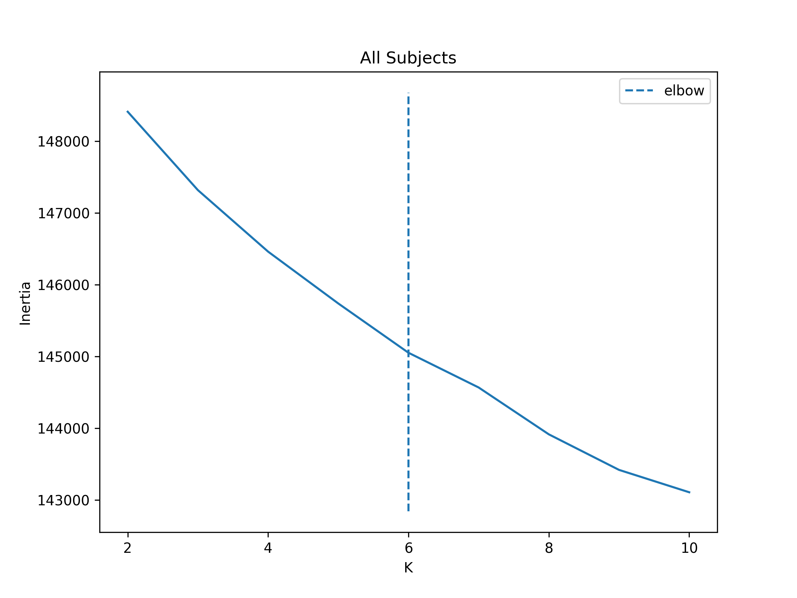
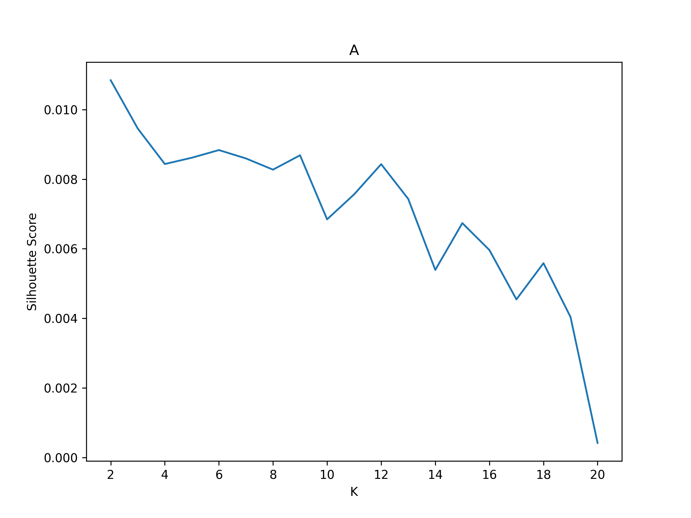
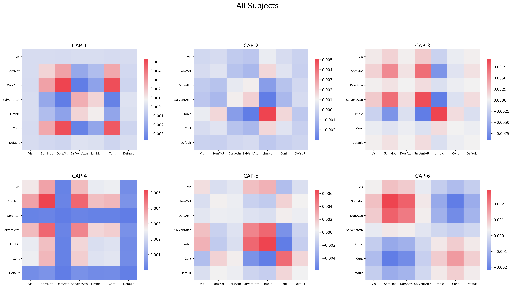
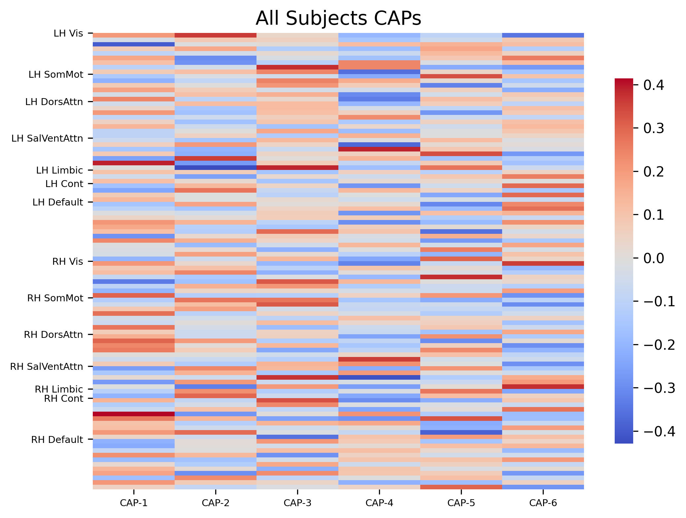
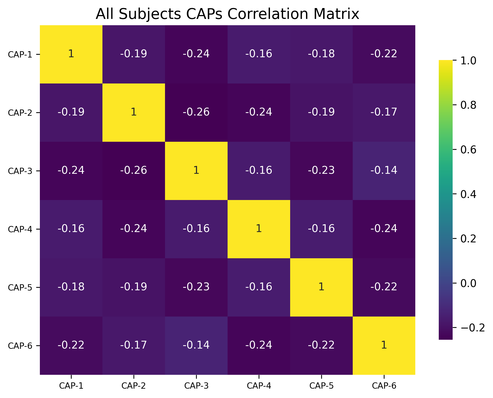
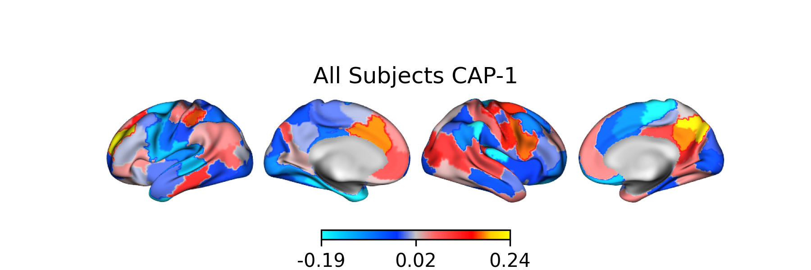
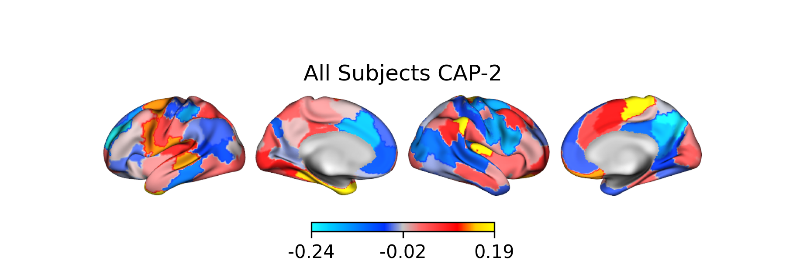
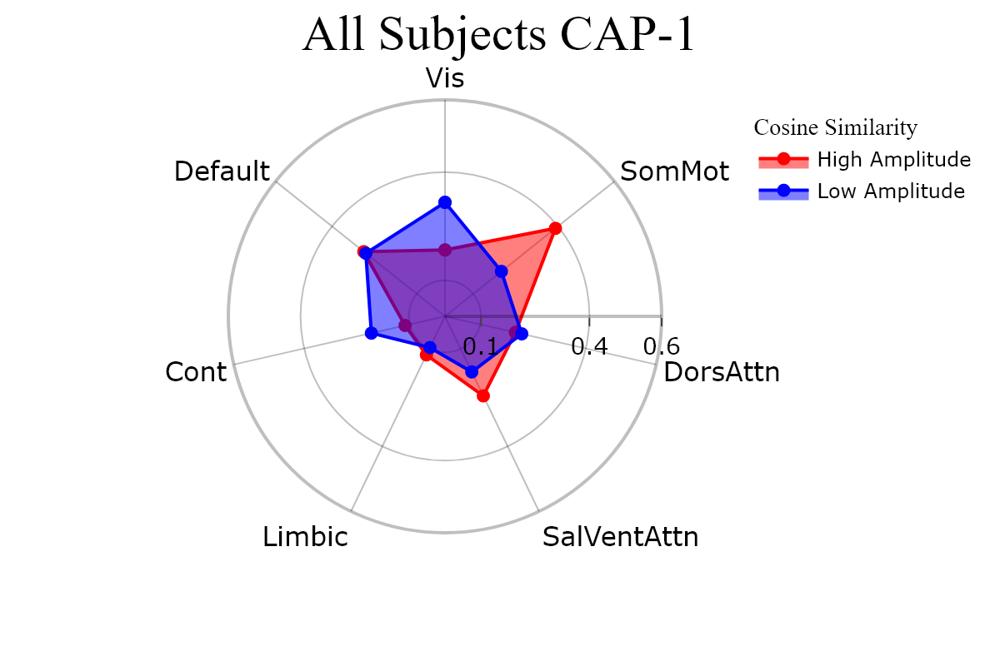
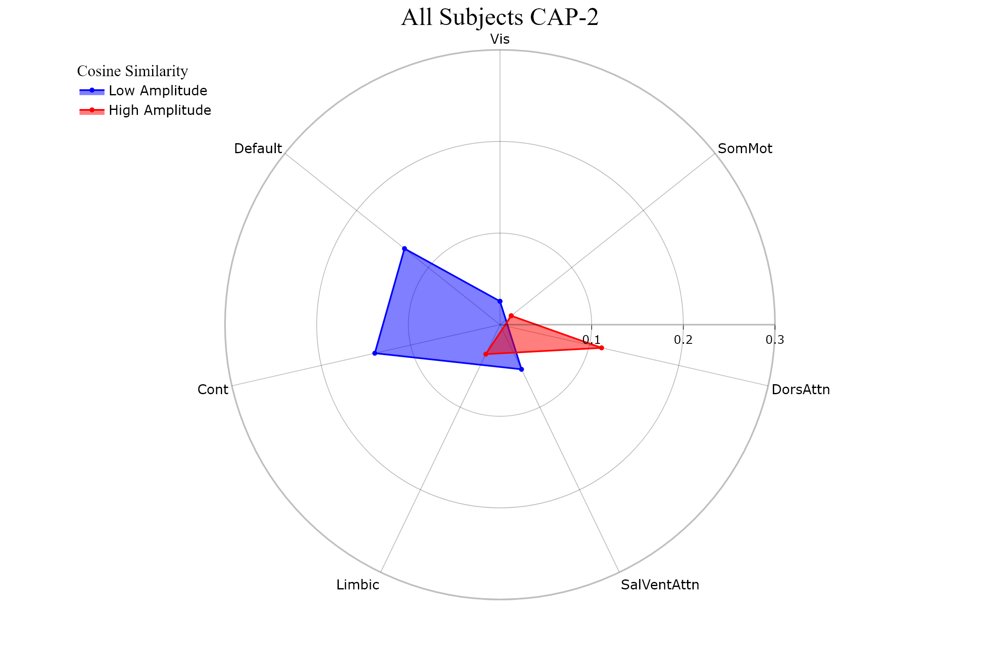

Tutorial 2: Using ``neurocaps.analysis.CAP``
============================================

Performing CAPs on All Subjects
-------------------------------
.. code-block:: python

    import numpy as np
    from neurocaps.extraction import TimeseriesExtractor
    from neurocaps.analysis import CAP

    # Extracting timseries
    parcel_approach = {"Schaefer": {"n_rois": 100, "yeo_networks": 7, "resolution_mm": 2}}

    # Simulate data for example
    subject_timeseries = {str(x) : {f"run-{y}": np.random.rand(100, 100) for y in range(1, 4)} for x in range(1, 11)}

    # Initialize CAP class
    cap_analysis = CAP()

    # Get CAPs
    cap_analysis.get_caps(subject_timeseries=subject_timeseries,
                          n_clusters=range(2, 11),
                          cluster_selection_method="elbow",
                          show_figs=True,
                          step=2)

.. rst-class:: sphx-glr-script-out

    .. code-block:: none

        2024-11-02 21:02:28,145 neurocaps.analysis.cap [INFO] [GROUP: All Subjects | METHOD: elbow] - Optimal cluster size is 6.

Performing CAPs on Groups
-------------------------
.. code-block:: python

    cap_analysis = CAP(groups={"A": ["1", "2", "3", "5"], "B": ["4", "6", "7", "8", "9", "10"]})

    cap_analysis.get_caps(subject_timeseries=subject_timeseries,
                          n_clusters=range(2, 21),
                          cluster_selection_method="silhouette",
                          show_figs=True,
                          step=2)

.. rst-class:: sphx-glr-script-out

    .. code-block:: none

        2024-11-02 21:02:28,322 neurocaps.analysis.cap [INFO] [GROUP: A | METHOD: silhouette] - Optimal cluster size is 2.

.. rst-class:: sphx-glr-script-out

    .. code-block:: none

        2024-11-02 21:02:28,541 neurocaps.analysis.cap [INFO] [GROUP: B | METHOD: silhouette] - Optimal cluster size is 2.

.. image:: embed/B_silhouette.png
    :width: 600

Calculate Metrics
-----------------
.. code-block:: python

    df_dict = cap_analysis.calculate_metrics(subject_timeseries=subject_timeseries,
                                             return_df=True,
                                             metrics=["temporal_fraction", "counts", "transition_probability"],
                                             continuous_runs=True)

    print(df_dict["temporal_fraction"])

.. csv-table::
   :file: embed/temporal_fraction.csv
   :header-rows: 1

Plotting CAPs
-------------

.. code-block:: python

    import seaborn as sns

    cap_analysis = CAP(parcel_approach=extractor.parcel_approach)

    cap_analysis.get_caps(subject_timeseries=subject_timeseries,
                          n_clusters=6)

    sns.diverging_palette(145, 300, s=60, as_cmap=True)

    palette = sns.diverging_palette(260, 10, s=80, l=55, n=256, as_cmap=True)

    kwargs = {"subplots": True, "fontsize": 14, "ncol": 3, "sharey": True,
              "tight_layout": False, "xlabel_rotation"L 0, "hspace": 0.3,
              "cmap": palette}

    cap_analysis.caps2plot(visual_scope="regions",
                           plot_options="outer_product",
                           show_figs=True,
                           **kwargs)

.. code-block:: python

    cap_analysis.caps2plot(visual_scope="nodes",
                           plot_options="heatmap",
                           xticklabels_size=7,
                           yticklabels_size=7,
                           show_figs=True)

Generate Pearson Correlation Matrix
-----------------------------------
.. code-block:: python

    cap_analysis.caps2corr(annot=True,
                           cmap="viridis",
                           show_figs=True)

.. code-block:: python

    corr_dict = cap_analysis.caps2corr(return_df=True)
    print(corr_dict["All Subjects"])

.. csv-table::
   :file: embed/All_Subjects_CAPs_correlation_matrix.csv
   :header-rows: 1

Creating Surface Plots
----------------------
.. code-block:: python

    from matplotlib.colors import LinearSegmentedColormap

    # Create the colormap
    colors = ["#1bfffe", "#00ccff", "#0099ff", "#0066ff", "#0033ff", "#c4c4c4", "#ff6666",
              "#ff3333", "#FF0000","#ffcc00","#FFFF00"]

    custom_cmap = LinearSegmentedColormap.from_list("custom_cold_hot", colors, N=256)

    # Apply custom cmap to surface plots
    cap_analysis.caps2surf(cmap=custom_cmap,
                           size=(500, 100),
                           layout="row")

Plotting CAPs to Radar
----------------------
.. code-block:: python

    radialaxis={"showline": True,
                "linewidth": 2,
                "linecolor": "rgba(0, 0, 0, 0.25)",
                "gridcolor": "rgba(0, 0, 0, 0.25)",
                "ticks": "outside" ,
                "tickfont": {"size": 14, "color": "black"},
                "range": [0, 0.6],
                "tickvals": [0.1, "", "", 0.4, "", "", 0.6]}

    legend = {"yanchor": "top",
              "y": 0.99,
              "x": 0.99,
              "title_font_family": "Times New Roman",
              "font": {"size": 12, "color": "black"}}

    colors =  {"High Amplitude": "red", "Low Amplitude": "blue"}

    kwargs = {"radialaxis": radial, "fill": "toself", "legend": legend,
              "color_discrete_map": colors, "height": 400, "width": 600}

    cap_analysis.caps2radar(**kwargs)

