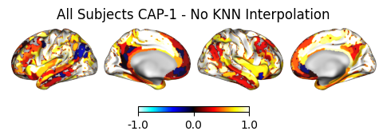
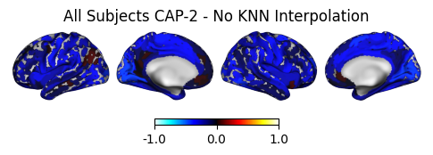
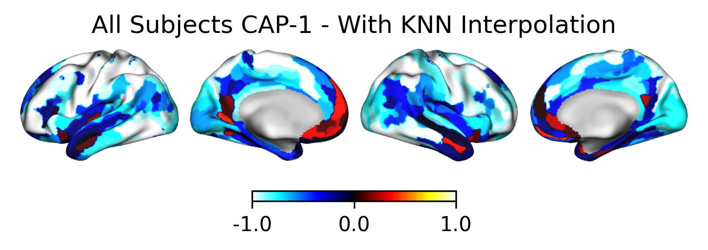
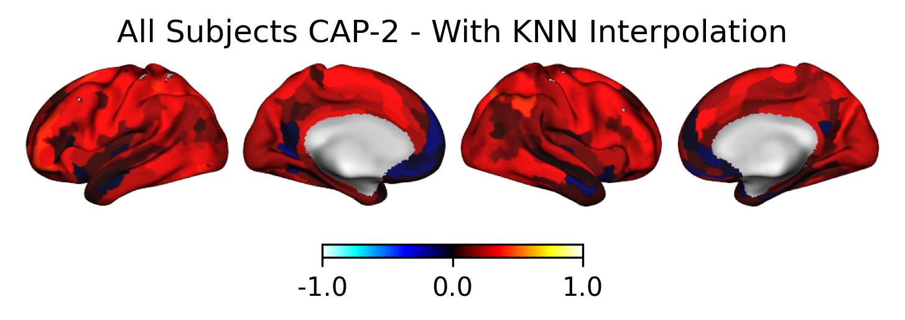
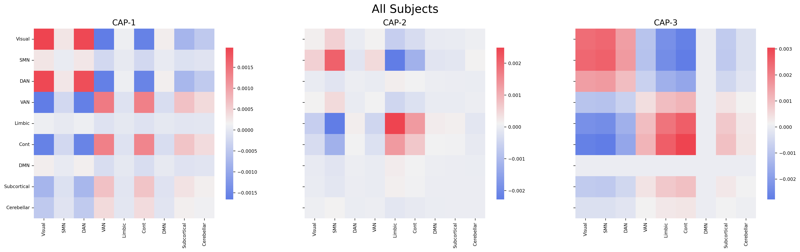
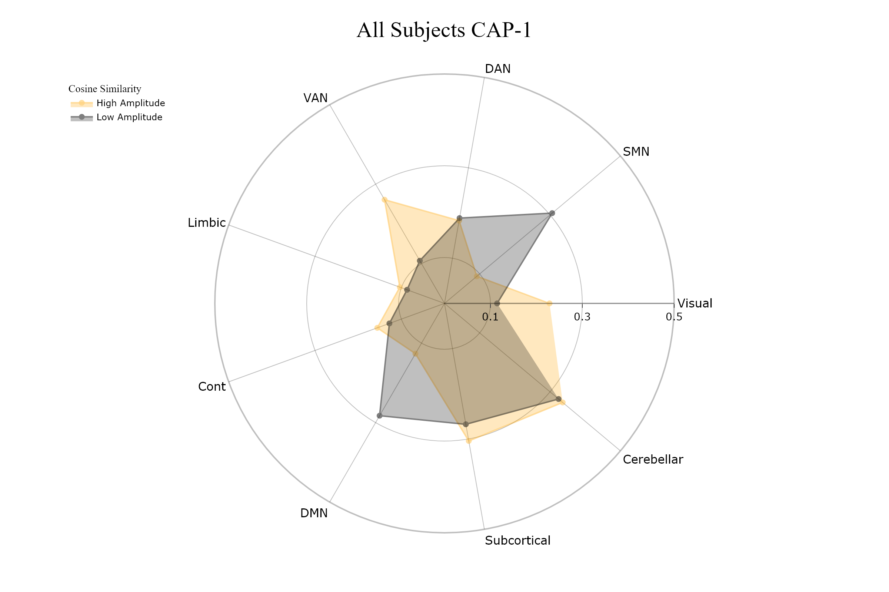
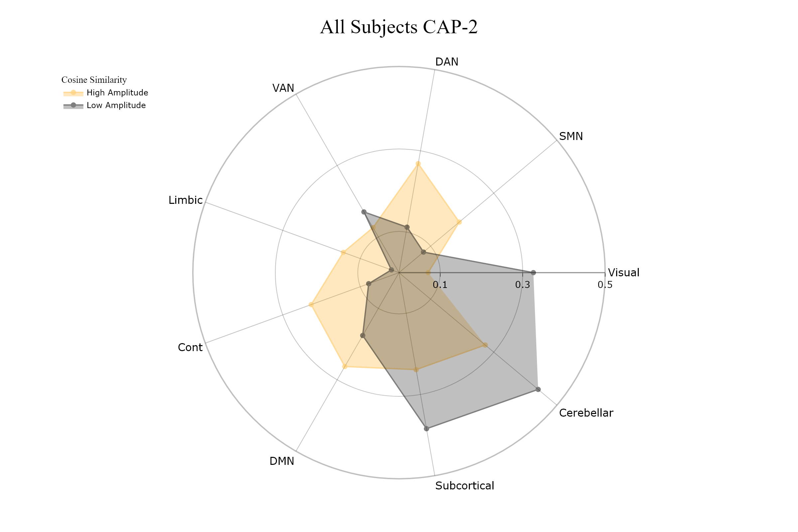
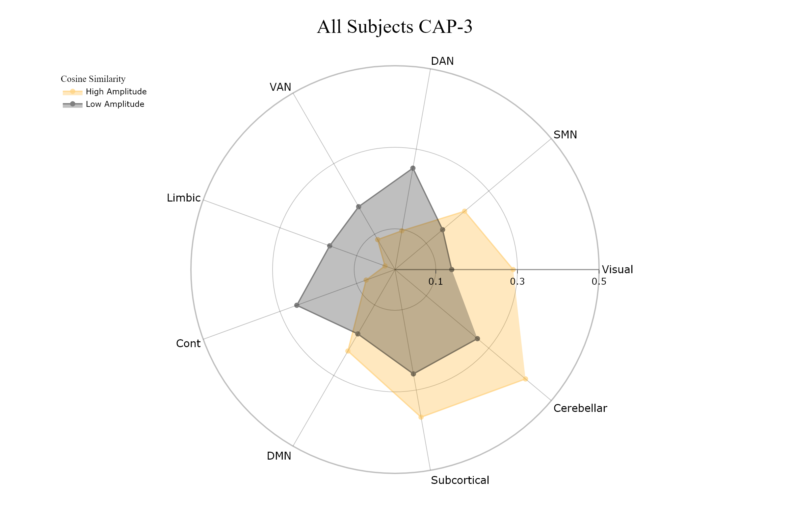

Tutorial 7: Using Custom Parcellations
======================================

.. |colab| image:: https://colab.research.google.com/assets/colab-badge.svg
   :target: https://colab.research.google.com/github/donishadsmith/neurocaps/blob/stable/docs/examples/notebooks/custom.ipynb

|colab|

While NeuroCAPs leverages Nilearn's fetch functions for the `Schaefer <https://nilearn.github.io/stable/modules/generated/nilearn.datasets.fetch_atlas_schaefer_2018.html>`_
and `AAL <https://nilearn.github.io/stable/modules/generated/nilearn.datasets.fetch_atlas_aal.html>`_, additional
deterministic parcellations (lateralized and non-lateralized) can be manually defined. For custom parcellation approaches, three subkeys are
recognized: "maps", "nodes", and "regions". For additional details on these subkeys, refer to the
`"Custom Parcellations" sub-section <https://neurocaps.readthedocs.io/en/stable/user_guide/parcellations.html#custom-parcellations>`_.

**Note:** Non-lateralized parcellations are supported in versions >= 0.30.0.

For this demonstration, the extended Human Connectome Project multimodal parcellation (HCPex) [1]_ [2]_ from
`wayalan's Github <https://github.com/wayalan/HCPex/>`_ will be used.

.. code-block:: python

    # Fetching atlas NiFTI image and labels from Github
    import os, subprocess, sys

    demo_dir = "neurocaps_demo"
    os.makedirs(demo_dir, exist_ok=True)

    if sys.platform != "win32":
        cmd = [
            [
                "wget",
                "-q",
                "-P",
                demo_dir,
                "https://github.com/wayalan/HCPex/raw/main/HCPex_v1.1/HCPex_LookUpTable.txt",
            ],
            [
                "wget",
                "-q",
                "-P",
                demo_dir,
                "https://github.com/wayalan/HCPex/raw/main/HCPex_v1.1/HCPex.nii.gz",
            ],
        ]
    else:
        cmd = [
            [
                "curl",
                "-L",
                "-o",
                f"{demo_dir}\\HCPex_LookUpTable.txt",
                "https://github.com/wayalan/HCPex/raw/main/HCPex_v1.1/HCPex_LookUpTable.txt",
            ],
            [
                "curl",
                "-L",
                "-o",
                f"{demo_dir}\\HCPex.nii.gz",
                "https://github.com/wayalan/HCPex/raw/main/HCPex_v1.1/HCPex.nii.gz",
            ],
        ]

    for command in cmd:
        subprocess.run(command, check=True)

The code below fetches a single subject from an `OpenNeuro dataset <https://openneuro.org/datasets/ds005381/versions/1.0.0>`_
preprocessed with `fMRIPrep <https://fmriprep.org/en/stable/>`_. Downloading data from OpenNeuro requires
``pip install openneuro-py ipywidgets`` or ``pip install neurocaps[demo]``.

.. code-block:: python

    # [Dataset] doi: doi:10.18112/openneuro.ds005381.v1.0.0
    from openneuro import download

    # Include the run-1 and run-2 data of a single subject
    include = [
        "dataset_description.json",
        "sub-0004/ses-2/func/*run-[12]*events*",
        "derivatives/fmriprep/sub-0004/fmriprep/sub-0004/ses-2/func/*run-[12]*confounds_timeseries*",
        "derivatives/fmriprep/sub-0004/fmriprep/sub-0004/ses-2/func/*run-[12]_space-MNI152NLin*preproc_bold*",
    ]

    download(
        dataset="ds005381",
        include=include,
        target_dir=demo_dir,
        verify_hash=False,
    )

.. rst-class:: sphx-glr-script-out

    .. code-block:: none

        👋 Hello! This is openneuro-py 2024.2.0. Great to see you! 🤗

        👉 Please report problems 🤯 and bugs 🪲 at
            https://github.com/hoechenberger/openneuro-py/issues

        🌍 Preparing to download ds005381 …

        📥 Retrieving up to 23 files (5 concurrent downloads).
        ✅ Finished downloading ds005381.

        🧠 Please enjoy your brains.

The first level of the pipeline directory must also have a dataset_description.json file for querying purposes.

.. code-block:: python

    import json

    desc = {
        "Name": "fMRIPrep - fMRI PREProcessing workflow",
        "BIDSVersion": "1.0.0",
        "DatasetType": "derivative",
        "GeneratedBy": [
            {"Name": "fMRIPrep", "Version": "20.2.0", "CodeURL": "https://github.com/nipreps/fmriprep"}
        ],
    }

    with open(
        "neurocaps_demo/derivatives/fmriprep/dataset_description.json", "w", encoding="utf-8"
    ) as f:
        json.dump(desc, f)

Extracting Timeseries
---------------------
For ``TimeseriesExtractor.get_bold``, only the "maps" subkey (the location of the parcellation) needs to be defined.

.. code-block:: python

    # Creating custom parcel approach dictionary and extracting timeseries
    parcel_approach = {"Custom": {}}

    parcel_approach["Custom"]["maps"] = os.path.join(demo_dir, "HCPex.nii.gz")

    from neurocaps.extraction import TimeseriesExtractor

    extractor = TimeseriesExtractor(
        space="MNI152NLin6Asym",
        parcel_approach=parcel_approach,
        standardize=True,
        use_confounds=True,
        confound_names="basic",
        low_pass=0.15,
        high_pass=None,
        dummy_scans="auto",
        fd_threshold={
            "threshold": 0.5,
            "outlier_percentage": 0.30,
            "use_sample_mask": True,
            "interpolate": False,
        },
    )

    # Using chaining to extract timeseries data and save dictionary as a pickle file
    extractor.get_bold(
        bids_dir="neurocaps_demo",
        session="2",
        task="DET",
        condition="late",
        condition_tr_shift=2,
        slice_time_ref=0.5,
        n_cores=None,
        flush=True,
        tr=2,
        verbose=True,
    ).timeseries_to_pickle(output_dir=demo_dir, filename="openneuro_data.pkl")

.. rst-class:: sphx-glr-script-out

    .. code-block:: none

        2025-06-13 14:11:27,418 neurocaps._utils.check_parcel_approach [WARNING] The following subkeys haven't been detected ['nodes', 'regions']. These labels are not needed for timeseries extraction but are needed for plotting.
        2025-06-13 14:11:27,419 neurocaps._utils.extraction.check_confound_names [INFO] Confound regressors to be used if available: cosine*, trans_x, trans_x_derivative1, trans_y, trans_y_derivative1, trans_z, trans_z_derivative1, rot_x, rot_x_derivative1, rot_y, rot_y_derivative1, rot_z, rot_z_derivative1, a_comp_cor_00, a_comp_cor_01, a_comp_cor_02, a_comp_cor_03, a_comp_cor_04, a_comp_cor_05.
        2025-06-13 14:11:28,975 neurocaps.extraction.timeseriesextractor [INFO] BIDS Layout: ...mples\notebooks\neurocaps_demo | Subjects: 1 | Sessions: 1 | Runs: 2
        2025-06-13 14:11:29,043 neurocaps._utils.extraction.extract_timeseries [INFO] [SUBJECT: 0004 | SESSION: 2 | TASK: DET | RUN: 1] Preparing for Timeseries Extraction using [FILE: sub-0004_ses-2_task-DET_run-1_space-MNI152NLin6Asym_res-2_desc-preproc_bold.nii.gz].
        2025-06-13 14:11:29,063 neurocaps._utils.extraction.extract_timeseries [INFO] [SUBJECT: 0004 | SESSION: 2 | TASK: DET | RUN: 1] No 'non_steady_state_outlier_XX' columns were found so 0 dummy scans will be removed.
        2025-06-13 14:11:29,086 neurocaps._utils.extraction.extract_timeseries [INFO] [SUBJECT: 0004 | SESSION: 2 | TASK: DET | RUN: 1] The following confounds will be used for nuisance regression: cosine00, cosine01, cosine02, cosine03, trans_x, trans_x_derivative1, trans_y, trans_y_derivative1, trans_z, trans_z_derivative1, rot_x, rot_x_derivative1, rot_y, rot_y_derivative1, rot_z, rot_z_derivative1, a_comp_cor_00, a_comp_cor_01, a_comp_cor_02, a_comp_cor_03, a_comp_cor_04, a_comp_cor_05.
        2025-06-13 14:11:39,939 neurocaps._utils.extraction.extract_timeseries [INFO] [SUBJECT: 0004 | SESSION: 2 | TASK: DET | RUN: 1] Nuisance regression completed; extracting [CONDITION: late].
        2025-06-13 14:11:39,977 neurocaps._utils.extraction.extract_timeseries [INFO] [SUBJECT: 0004 | SESSION: 2 | TASK: DET | RUN: 2] Preparing for Timeseries Extraction using [FILE: sub-0004_ses-2_task-DET_run-2_space-MNI152NLin6Asym_res-2_desc-preproc_bold.nii.gz].
        2025-06-13 14:11:39,994 neurocaps._utils.extraction.extract_timeseries [INFO] [SUBJECT: 0004 | SESSION: 2 | TASK: DET | RUN: 2] No 'non_steady_state_outlier_XX' columns were found so 0 dummy scans will be removed.
        2025-06-13 14:11:40,006 neurocaps._utils.extraction.extract_timeseries [INFO] [SUBJECT: 0004 | SESSION: 2 | TASK: DET | RUN: 2] The following confounds will be used for nuisance regression: cosine00, cosine01, cosine02, cosine03, trans_x, trans_x_derivative1, trans_y, trans_y_derivative1, trans_z, trans_z_derivative1, rot_x, rot_x_derivative1, rot_y, rot_y_derivative1, rot_z, rot_z_derivative1, a_comp_cor_00, a_comp_cor_01, a_comp_cor_02, a_comp_cor_03, a_comp_cor_04, a_comp_cor_05.
        2025-06-13 14:11:50,949 neurocaps._utils.extraction.extract_timeseries [INFO] [SUBJECT: 0004 | SESSION: 2 | TASK: DET | RUN: 2] Nuisance regression completed; extracting [CONDITION: late].

For visualization methods in the ``TimeseriesExtractor`` and ``CAP`` classes, the nodes and regions need to be defined.
Refer to the documentation for each function to determine which subkeys are required, as some methods only need the
"maps" subkey, while others require the "nodes" and "regions" subkeys.

The following code defines the nodes and regions of the HCPex parcellation.

.. code-block:: python

    import joblib, pandas as pd

    # Setting the "nodes"; needed for `TimeseriesExtractor.visualize_bold`; Getting nodes that don't correspond to
    # background label
    parcel_approach["Custom"]["nodes"] = pd.read_csv(
        os.path.join(demo_dir, "HCPex_LookUpTable.txt"),
        sep=None,
        engine="python",
    )["Label"].values[1:]

    # Needed for many plotting methods; Setting the region names and their corresponding indices in the nodes list,
    # in this case it is just the label id - 1
    parcel_approach["Custom"]["regions"] = {
        "Primary Visual": {"lh": [0], "rh": [180]},
        "Early Visual": {"lh": [1, 2, 3], "rh": [181, 182, 183]},
        "Dorsal Stream Visual": {"lh": range(4, 10), "rh": range(184, 190)},
        "Ventral Stream Visual": {"lh": range(10, 17), "rh": range(190, 197)},
        "MT+ Complex": {"lh": range(17, 26), "rh": range(197, 206)},
        "SomaSens Motor": {"lh": range(26, 31), "rh": range(206, 211)},
        "ParaCentral MidCing": {"lh": range(31, 40), "rh": range(211, 220)},
        "Premotor": {"lh": range(40, 47), "rh": range(220, 227)},
        "Posterior Opercular": {"lh": range(47, 52), "rh": range(227, 232)},
        "Early Auditory": {"lh": range(52, 59), "rh": range(232, 239)},
        "Auditory Association": {"lh": range(59, 67), "rh": range(239, 247)},
        "Insula FrontalOperc": {"lh": range(67, 79), "rh": range(247, 259)},
        "Medial Temporal": {"lh": range(79, 87), "rh": range(259, 267)},
        "Lateral Temporal": {"lh": range(87, 95), "rh": range(267, 275)},
        "TPO": {"lh": range(95, 100), "rh": range(275, 280)},
        "Superior Parietal": {"lh": range(100, 110), "rh": range(280, 290)},
        "Inferior Parietal": {"lh": range(110, 120), "rh": range(290, 300)},
        "Posterior Cingulate": {"lh": range(120, 133), "rh": range(300, 313)},
        "AntCing MedPFC": {"lh": range(133, 149), "rh": range(313, 329)},
        "OrbPolaFrontal": {"lh": range(149, 158), "rh": range(329, 338)},
        "Inferior Frontal": {"lh": range(158, 167), "rh": range(338, 347)},
        "Dorsolateral Prefrontal": {"lh": range(167, 180), "rh": range(347, 360)},
        "Subcortical Regions": {"lh": range(360, 393), "rh": range(393, 426)},
    }

    # Saving the dictionary as a pickle file for long-term storage
    with open(os.path.join(demo_dir, "HCPex_dict.pkl"), "wb") as f:
        joblib.dump(parcel_approach, f)

Visualizing BOLD data
---------------------

.. code-block:: python

    # Setting updated parcellation approach
    extractor.parcel_approach = parcel_approach

    extractor.visualize_bold(
        subj_id="0004", run=1, region="TPO", figsize=(5, 4), output_dir=demo_dir, filename="HCPex_TPO"
    )

.. image:: embed/HCPex_TPO.png
    :width: 800

Extracting CAPs
---------------

The following code uses ``CAP.get_bold`` to extract two CAPs.

.. code-block:: python

    from neurocaps.analysis import CAP

    # Will use the setter method to set the parcel approach later since a parcel approach
    # does not need to be defined for the `get_caps` method
    cap_analysis = CAP(parcel_approach=None)

    # Either method works
    cap_analysis.get_caps(subject_timeseries=extractor.subject_timeseries, n_clusters=2)

    # Alternative approach using pickle file:
    # cap_analysis.get_caps(subject_timeseries="openneuro_data.pkl", n_clusters=2)

.. rst-class:: sphx-glr-script-out

    .. code-block:: none

        2025-06-13 14:12:14,255 neurocaps.analysis.cap [INFO] No groups specified. Using default group 'All Subjects' containing all subject IDs from `subject_timeseries`. The `self.groups` dictionary will remain fixed unless the `CAP` class is re-initialized.

Surface Plotting with and without KNN Interpolation
---------------------------------------------------

For the following code, the CAPs will be plotted to surface space with and without KNN (K-Nearest Neighbors)
interpolation. Some parcellations may have issues projecting from MNI space to fsLR space. The ``knn_dict`` parameter,
which is available in both ``CAP.caps2niftis()`` and ``CAP.caps2surf()`` can be used to improve the visualization. The
KNN method uses a reference atlas (either Schaefer or AAL) as a mask to determine the non-background voxels to
interpolate prior to projecting from MNI to fsLR space. *Note, for this method, only the "maps" subkey is required, the
other subkeys are optional*.

.. code-block:: python

    # Setting parcellation approach using pickle file
    cap_analysis.parcel_approach = os.path.join(demo_dir, "HCPex_dict.pkl")

    # Without KNN interpolation
    cap_analysis.caps2surf(
        size=(500, 100),
        layout="row",
        color_range=[-1, 1],
        output_dir=demo_dir,
        suffix_title="- No KNN Interpolation",
        suffix_filename="original",
    )

    # With KNN interpolation
    cap_analysis.caps2surf(
        size=(500, 100),
        layout="row",
        color_range=[-1, 1],
        knn_dict={"k": 5, "reference_atlas": "Schaefer", "method": "majority_vote"},
        output_dir=demo_dir,
        suffix_title="- With KNN Interpolation",
        suffix_filename="KNN",
    )

.. rst-class:: sphx-glr-script-out

    .. code-block:: none

        2025-06-13 14:15:00,435 neurocaps.analysis.cap [WARNING] Defaulting to 1mm resolution for the Schaefer atlas since 'resolution_mm' was not specified in `knn_dict`.

Simulated Example with Schaefer 4S
----------------------------------

.. code-block:: python

    # Fetching atlas NiFTI image and labels from Github
    if sys.platform != "win32":
        cmd = [
            [
                "wget",
                "-q",
                "-P",
                "neurocaps_demo",
                "https://github.com/PennLINC/AtlasPack/raw/main/atlas-4S156Parcels_dseg.tsv",
            ],
        ]
    else:
        cmd = [
            [
                "curl",
                "-L",
                "-o",
                "neurocaps_demo\\atlas-4S156Parcels_dseg.tsv",
                "https://github.com/PennLINC/AtlasPack/raw/main/atlas-4S156Parcels_dseg.tsv",
            ],
        ]

    for command in cmd:
        subprocess.run(command, check=True)

    # Creating custom parcel approach dictionary and extracting timeseries
    parcel_approach = {"Custom": {}}

    # Setting the "nodes", which is needed for "TimeseriesExtractor.visualize_bold";
    # Getting nodes that don't correspond to background label
    parcel_approach["Custom"]["nodes"] = pd.read_csv(
        "neurocaps_demo\\atlas-4S156Parcels_dseg.tsv",
        sep="\t",
    )["label"].values

    # Needed for many plotting methods; Setting the region names and their corresponding indices
    # in the nodes list in this case it is just the label id - 1
    parcel_approach["Custom"]["regions"] = {
        "Visual": [*range(0, 9), *range(50, 58)],
        "SMN": [*range(9, 15), *range(58, 66)],
        "DAN": [*range(15, 23), *range(66, 73)],
        "VAN": [*range(23, 30), *range(73, 78)],
        "Limbic": [*range(30, 33), *range(78, 80)],
        "Cont": [*range(33, 37), *range(80, 89)],
        "DMN": [*range(37, 50), *range(89, 100)],
        "Subcortical": [*range(100, 146)],
        "Cerebellar": [*range(100, 156)],
    }

.. code-block:: python

    import numpy as np

    sub_ids = [f"0{x}" if x < 10 else x for x in range(1, 11)]
    subject_timeseries = {
        str(x): {f"run-{y}": np.random.rand(50, 156) for y in range(1, 4)} for x in sub_ids
    }

    cap_analysis = CAP(parcel_approach=None)
    cap_analysis.parcel_approach = parcel_approach
    cap_analysis.get_caps(subject_timeseries=subject_timeseries, n_clusters=3)

.. code-block:: python

    import seaborn as sns

    sns.diverging_palette(145, 300, s=60, as_cmap=True)

    palette = sns.diverging_palette(260, 10, s=80, l=55, n=256, as_cmap=True)

    cap_analysis.caps2plot(visual_scope="regions", plot_options="heatmap", borderwidths=10)

    cap_analysis.caps2plot(
        visual_scope="regions",
        plot_options="outer_product",
        subplots=True,
        fontsize=14,
        tight_layout=False,
        xlabel_rotation=90,
        hspace=0.3,
        cmap=palette,
        output_dir="neurocaps_demo",
    )

.. code-block:: python

    radialaxis = {
        "showline": True,
        "linewidth": 2,
        "linecolor": "rgba(0, 0, 0, 0.25)",
        "gridcolor": "rgba(0, 0, 0, 0.25)",
        "ticks": "outside",
        "tickfont": {"size": 14, "color": "black"},
        "range": [0, 0.5],
        "tickvals": [0.1, "", 0.3, "", 0.5],
    }

    color_discrete_map = {
        "High Amplitude": "rgba(255, 165, 0, 0.75)",
        "Low Amplitude": "black",
    }

    cap_analysis.caps2radar(
        radialaxis=radialaxis,
        fill="toself",
        color_discrete_map=color_discrete_map,
        use_scatterpolar=True,
        output_dir="neurocaps_demo",
        as_html=True,
    )

.. only:: html

  .. container:: sphx-glr-footer sphx-glr-footer-example

    .. container:: sphx-glr-download sphx-glr-download-jupyter

      :download:`Download Jupyter Notebook <notebooks/custom.ipynb>`

==========

.. [1] Huang, CC., Rolls, E.T., Feng, J. et al. An extended Human Connectome Project multimodal parcellation atlas of the human cortex and subcortical areas. Brain Struct Funct 227, 763–778 (2022). https://doi.org/10.1007/s00429-021-02421-6

.. [2] Huang, C.-C., Rolls, E. T., Hsu, C.-C. H., Feng, J., & Lin, C.-P. (2021). Extensive Cortical Connectivity of the Human Hippocampal Memory System: Beyond the “What” and “Where” Dual Stream Model. Cerebral Cortex, 31(10), 4652–4669. https://doi.org/10.1093/cercor/bhab113
