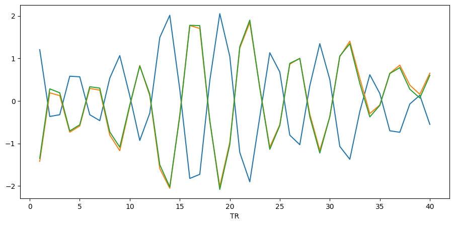
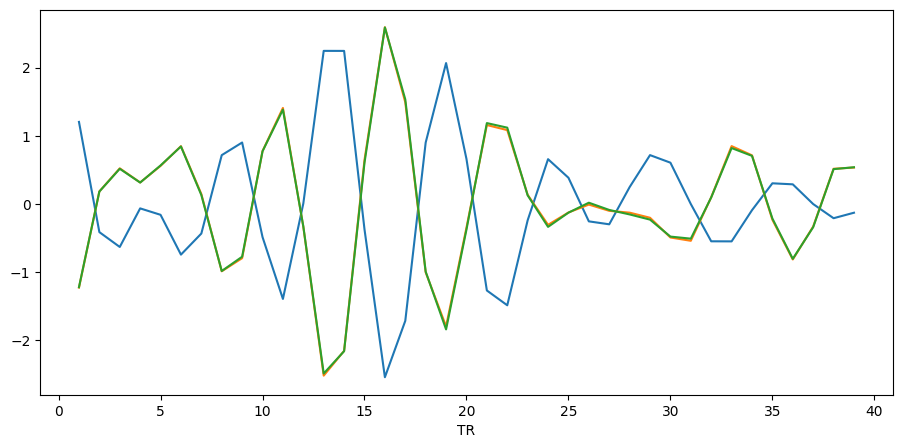

Tutorial 1: Using ``TimeseriesExtractor``
=========================================

.. |colab| image:: https://colab.research.google.com/assets/colab-badge.svg
   :target: https://colab.research.google.com/github/donishadsmith/neurocaps/blob/stable/docs/examples/notebooks/extraction.ipynb

|colab|

This module is designed to perform timeseries extraction, nuisance regression, and visualization. Additionally, it
generates the necessary dictionary structure required for ``CAP``. If the BOLD images have not been preprocessed using
fMRIPrep (or a similar pipeline), the dictionary structure can be manually created.

The output in the `Extracting Timeseries` section is generated from a test run using GitHub Actions. This test uses
a truncated version of the open dataset provided by `Laumann & Poldrack <https://openfmri.org/dataset/ds000031/>`_ [1]_
and was obtained from the OpenfMRI database, accession number ds000031.

Extracting Timeseries
---------------------
Download test dataset used for Github Actions from Github.

.. code-block:: python

    import os, subprocess, sys

    demo_dir = "neurocaps_demo"
    os.makedirs(demo_dir, exist_ok=True)

    if sys.platform != "win32":
        cmd = """
            cd neurocaps_demo
            git clone --depth 1 --filter=blob:none --sparse https://github.com/donishadsmith/neurocaps.git
            cd neurocaps
            git sparse-checkout set tests/data/dset
            """
        os.system(cmd)
    else:
        repo_dir = os.path.join(demo_dir, "neurocaps")

        # Enable git longpath
        subprocess.run(
            ["git", "config", "--global", "core.longpaths", "true"],
            check=True,
        )

        subprocess.run(
            [
                "git",
                "clone",
                "--depth",
                "1",
                "--filter=blob:none",
                "--sparse",
                "https://github.com/donishadsmith/neurocaps.git",
            ],
            check=True,
            cwd=demo_dir,
        )

        subprocess.run(
            ["git", "sparse-checkout", "set", "tests/data/dset"],
            check=True,
            cwd=repo_dir,
        )

    # Rename folder
    os.makedirs("neurocaps_demo/data", exist_ok=True)
    os.rename("neurocaps_demo/neurocaps/tests/data/dset", "neurocaps_demo/data/dset")

Note: when an asterisk (*) follows a name, all confounds that start with the preceding term will be automatically included.
For example, placing an asterisk after cosine (cosine*) will utilize all parameters that begin with cosine.

.. code-block:: python

    from neurocaps.extraction import TimeseriesExtractor

    confounds = ["cosine*", "a_comp_cor*", "rot*"]

    parcel_approach = {"Schaefer": {"n_rois": 100, "yeo_networks": 7, "resolution_mm": 2}}

    extractor = TimeseriesExtractor(
        space="MNI152NLin2009cAsym",
        parcel_approach=parcel_approach,
        standardize="zscore_sample",
        use_confounds=True,
        detrend=True,
        low_pass=0.15,
        high_pass=None,
        confound_names=confounds,
    )

    extractor.get_bold(
        bids_dir="neurocaps_demo/data/dset",
        session="002",
        task="rest",
        pipeline_name="fmriprep_1.0.0/fmriprep",
        tr=1.2,
        progress_bar=True,  # Parameter available in versions >= 0.21.5
    )

.. rst-class:: sphx-glr-script-out

    .. code-block:: none

        2025-03-21 18:59:28,359 neurocaps._utils.extraction.check_confound_names [INFO] Confound regressors to be used if available: cosine*, a_comp_cor*, rot*.
        2025-03-21 18:59:29,679 neurocaps.extraction.timeseriesextractor [INFO] BIDS Layout: ...demos\neurocaps_demo\data\dset | Subjects: 1 | Sessions: 1 | Runs: 1
        2025-03-21 18:59:29,826 neurocaps._utils.extraction.extract_timeseries [INFO] [SUBJECT: 01 | SESSION: 002 | TASK: rest | RUN: 001] Preparing for Timeseries Extraction using [FILE: sub-01_ses-002_task-rest_run-001_space-MNI152NLin2009cAsym_desc-preproc_bold.nii.gz].
        2025-03-21 18:59:29,840 neurocaps._utils.extraction.extract_timeseries [INFO] [SUBJECT: 01 | SESSION: 002 | TASK: rest | RUN: 001] The following confounds will be used for nuisance regression: cosine_00, cosine_01, cosine_02, cosine_03, cosine_04, cosine_05, cosine_06, a_comp_cor_00, a_comp_cor_01, a_comp_cor_02, a_comp_cor_03, a_comp_cor_04, a_comp_cor_05, rot_x, rot_y, rot_z.
        Processing Subjects: 100%|██████████████████████████████████████████████████████████████████████████████████████████████████████████████████████████████████| 1/1 [00:05<00:00,  5.73s/it]

``print`` can be used to return a string representation of the ``TimeseriesExtractor`` class.

.. code-block:: python

    print(extractor)

.. rst-class:: sphx-glr-script-out

    .. code-block:: none

        Metadata:
        ===========================================================
        Preprocessed Bold Template Space                           : MNI152NLin2009cAsym
        Parcellation Approach                                      : Schaefer
        Signal Clean Information                                   : {'masker_init': {'standardize': 'zscore_sample', 'detrend': True, 'low_pass': 0.15, 'high_pass': None, 'smoothing_fwhm': None}, 'use_confounds': True, 'confound_names': ['cosine*', 'a_comp_cor*', 'rot*'],
        'n_acompcor_separate': None, 'dummy_scans': None, 'fd_threshold': None, 'dtype': None}
        Task Information                                           : {'task': 'rest', 'session': '002', 'runs': None, 'condition': None, 'condition_tr_shift': 0, 'tr': 1.2, 'slice_time_ref': 0.0}
        Number of Subjects                                         : 1
        CPU Cores Used for Timeseries Extraction (Multiprocessing) : None
        Subject Timeseries Byte Size                               : 16184 bytes

The extracted timeseries is stored as a nested dictionary and can be accessed using the ``subject_timeseries``
property. The ``TimeseriesExtractor`` class has several
`properties <https://neurocaps.readthedocs.io/en/stable/generated/neurocaps.extraction.TimeseriesExtractor.html#properties>`_.
**Some properties can also be used as setters.**

.. code-block:: python

    print(extractor.subject_timeseries)

.. rst-class:: sphx-glr-script-out

    .. code-block:: none

        {'01': {'run-001': array([[ 1.2038397 , -1.4217342 , -1.352524  , ..., -0.01774308,
                0.30273473, -0.60237604],
            [-0.36782   ,  0.18963344,  0.2827883 , ..., -1.2160927 ,
                1.0700601 ,  1.0484216 ],
            [-0.32511464,  0.12289995,  0.18990105, ..., -1.0471789 ,
                1.092423  ,  0.80453503],
            ...,
            [-0.07272357,  0.37041494,  0.27384868, ...,  1.3793082 ,
                -1.2230965 , -0.6082778 ],
            [ 0.13115329,  0.1551035 ,  0.06789544, ...,  2.4453828 ,
                -1.2500157 , -0.67959505],
            [-0.5520303 ,  0.65005803,  0.6004126 , ..., -0.55654204,
                -0.2589798 ,  0.09717632]], shape=(40, 100), dtype=float32)}}

Reporting Quality Control Metrics
---------------------------------
Only censored frames with valid data on both sides are interpolated, while censored frames at the edge of the
timeseries (including frames that border censored edges) are always scrubbed and counted in "Frames_Scrubbed".
Additionally, `scipy's Cubic Spline <https://docs.scipy.org/doc/scipy/reference/generated/scipy.interpolate.CubicSpline.html>`_
is used to only interpolate censored frames.

.. code-block:: python

    extractor.report_qc(output_dir=demo_dir, filename="qc.csv", return_df=True)

.. csv-table::
   :file: embed/qc.csv
   :header-rows: 1

Saving Timeseries
-----------------
.. code-block:: python

    extractor.timeseries_to_pickle(output_dir=demo_dir, filename="rest_Schaefer.pkl")

Visualizing Timeseries
----------------------
.. code-block:: python

    # Visualizing a region
    extractor.visualize_bold(subj_id="01", run="001", region="Vis")

.. image:: embed/visualize_timeseries_regions.png
    :width: 1000

.. code-block:: python

    # Visualizing a several nodes
    extractor.visualize_bold(subj_id="01", run="001", roi_indx=[0, 1, 2])
    extractor.visualize_bold(subj_id="01", run="001", roi_indx=["LH_Vis_1", "LH_Vis_2", "LH_Vis_3"])

.. only:: html

  .. container:: sphx-glr-footer sphx-glr-footer-example

    .. container:: sphx-glr-download sphx-glr-download-jupyter

       :download:`Download Jupyter Notebook <notebooks/extraction.ipynb>`

==========

.. [1] Laumann, T. O., Gordon, E. M., Adeyemo, B., Snyder, A. Z., Joo, S. J., Chen, M. Y., Gilmore, A. W., McDermott, K. B., Nelson, S. M., Dosenbach, N. U., Schlaggar, B. L., Mumford, J. A., Poldrack, R. A., & Petersen, S. E. (2015). Functional system and areal organization of a highly sampled individual human brain. Neuron, 87(3), 657–670. https://doi.org/10.1016/j.neuron.2015.06.037
