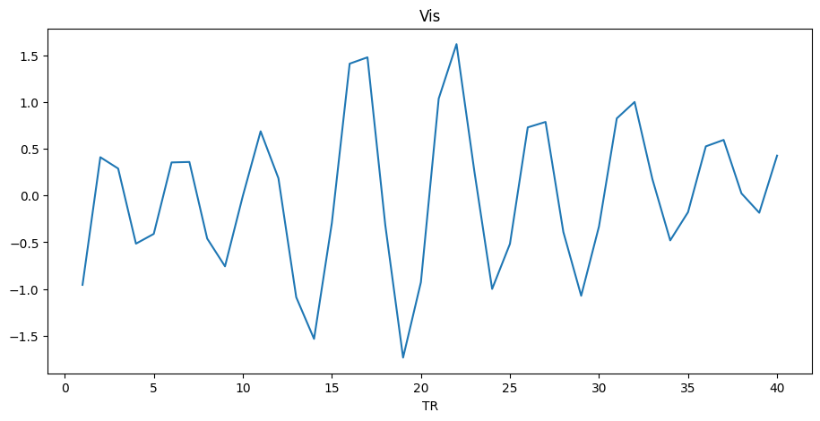
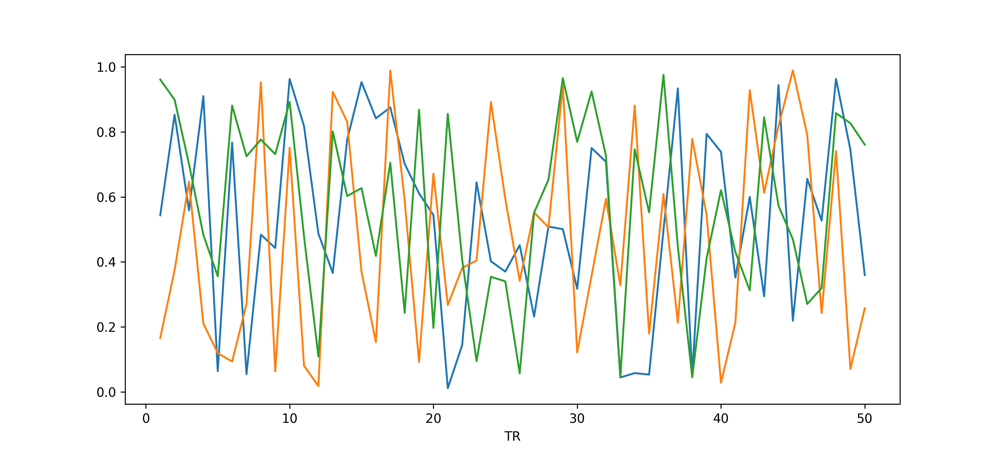

Tutorial 1: Using ``neurocaps.extraction.TimeseriesExtractor``
==============================================================
The purpose of this module is to perform timeseries extraction, cleaning, and visualization. Additionally, it is used
to create the necessary dictionary structure needed for CAP. Technically, this dictionary structure can be manually
created if the BOLD images where not preprocessed using fMRIPrep. Output from the `Extracting Timeseries` section
is from a test from Github Actions using a truncated version of an open dataset provided by `Laumann & Poldrack <https://openfmri.org/dataset/ds000031/>`_ 
and used in `Laumann et al., 2015 <https://doi.org/10.1016/j.neuron.2015.06.037>`_ [1]_ was also utilized. This data was obtained from the OpenfMRI database, accession number ds000031.

Extracting Timeseries
---------------------

.. code-block:: python

    from neurocaps.extraction import TimeseriesExtractor
    dir = os.path.dirname(__file__)

    """If an asterisk '*' is after a name, all confounds starting with the 
    term preceding the parameter will be used. in this case, all parameters 
    starting with cosine will be used."""

    confounds=["Cosine*", "aComp*", "Rot*"]

    parcel_approach = {"Schaefer": {"n_rois": 100, "yeo_networks": 7}}

    extractor = TimeseriesExtractor(parcel_approach=parcel_approach, standardize="zscore_sample",
                                    use_confounds=True, detrend=True, low_pass=0.15, high_pass=0.01,
                                    confound_names=confounds)

    bids_dir = os.path.join(dir, "ds000031_R1.0.4_ses001-022/ds000031_R1.0.4")
    
    # Can use the `n_cores` parameter for multiprocessing
    pipeline_name = "fmriprep_1.0.0/fmriprep"
    extractor.get_bold(bids_dir=bids_dir, session='002', task="rest", pipeline_name=pipeline_name, tr=1.2)

.. rst-class:: sphx-glr-script-out

    .. code-block:: none

        List of confound regressors that will be used during timeseries extraction if available in confound dataframe: Cosine*, aComp*, Rot*.

        BIDS Layout: ...0.4_ses001-022/ds000031_R1.0.4 | Subjects: 1 | Sessions: 1 | Runs: 1

        [SUBJECT: 01 | SESSION: 002 | TASK: rest | RUN: 001]
        ----------------------------------------------------
        Preparing for timeseries extraction using - [FILE: '/Users/runner/work/neurocaps/neurocaps/tests/ds000031_R1.0.4_ses001-022/ds000031_R1.0.4/derivatives/fmriprep_1.0.0/fmriprep/sub-01/ses-002/func/sub-01_ses-002_task-rest_run-001_space-MNI152NLin2009cAsym_desc-preproc_bold.nii.gz']

        [SUBJECT: 01 | SESSION: 002 | TASK: rest | RUN: 001]
        ----------------------------------------------------
        The following confounds will be for nuisance regression: Cosine00, Cosine01, Cosine02, Cosine03, Cosine04, Cosine05, Cosine06, aCompCor00, aCompCor01, aCompCor02, aCompCor03, aCompCor04, aCompCor05, RotX, RotY, RotZ.

.. code-block:: python

    print(extraction.subject_timeseries)

.. rst-class:: sphx-glr-script-out

    .. code-block:: none

        {'01': {'run-001': array([[-0.12410211, -0.746016  , -0.9138416 , ...,  0.12293668,
        -0.3167036 , -0.4593077 ],
       [-1.0730965 ,  0.88747275,  0.83726895, ..., -0.9314818 ,
         0.5686499 ,  0.9783575 ],
       [-0.5288149 ,  0.62266237,  0.6349383 , ..., -0.5331197 ,
         0.5261529 ,  0.5858582 ],
       ...,
       [ 0.32443312, -0.42479128, -0.43596116, ...,  0.5425763 ,
        -0.2863486 , -0.31798226],
       [ 0.94420713, -0.7662241 , -0.6925075 , ...,  1.7636685 ,
        -0.4194046 , -0.5691561 ],
       [ 0.4901481 ,  0.33806482,  0.48850006, ..., -0.29197463,
        -0.08600576, -0.08736482]], dtype=float32)}}

  
Saving Timeseries
-----------------
.. code-block:: python

    extractor.timeseries_to_pickle(output_dir="path/to/dir", filename="task-positive_Schaefer.pkl")

Visualizing Timeseries
----------------------
.. code-block:: python

    # Visualizing a region
    extractor.visualize_bold(subj_id="1", region="Vis")

.. code-block:: python

    # Visualizing a several nodes
    extractor.visualize_bold(subj_id="1",run=1, roi_indx=[0,1,2])
    # or
    extractor.visualize_bold(subj_id="1",run=1, roi_indx=["LH_Vis_1","LH_Vis_2","LH_Vis_3"])

==========

.. [1] Laumann, T. O., Gordon, E. M., Adeyemo, B., Snyder, A. Z., Joo, S. J., Chen, M. Y., Gilmore, A. W., McDermott, K. B., Nelson, S. M., Dosenbach, N. U., Schlaggar, B. L., Mumford, J. A., Poldrack, R. A., & Petersen, S. E. (2015). Functional system and areal organization of a highly sampled individual human brain. Neuron, 87(3), 657–670. https://doi.org/10.1016/j.neuron.2015.06.037