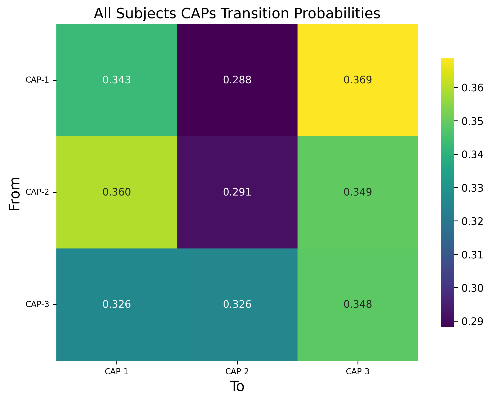

Tutorial 6: Generating Transition Probability Matrices ``transition_matrix``
===============================================================================================

.. |colab| image:: https://colab.research.google.com/assets/colab-badge.svg
   :target: https://colab.research.google.com/github/donishadsmith/neurocaps/blob/stable/docs/examples/notebooks/transition.ipynb

|colab|

The ``CAP.calculate_metrics()`` function is designed to compute transition probabilities for all subjects and store these
values into dataframes (one per group). These dataframes can subsequently be used as input for the ``transition_matrix()``
function to generate visualizations of the average transition probabilities per group.

.. code-block:: python

    import numpy as np
    from neurocaps.analysis import CAP, transition_matrix

    # Simulate `subject_timeseries` structure; Subject IDs will be sorted lexicographically
    sub_ids = [f"0{x}" if x < 10 else x for x in range(1, 11)]
    subject_timeseries = {
        str(x): {f"run-{y}": np.random.rand(10, 100) for y in range(1, 4)} for x in sub_ids
    }

    cap_analysis = CAP()

    cap_analysis.get_caps(
        subject_timeseries=subject_timeseries,
        cluster_selection_method="davies_bouldin",
        standardize=True,
        n_clusters=list(range(2, 6)),
    )

.. rst-class:: sphx-glr-script-out

    .. code-block:: none

        2024-11-02 00:09:54,273 neurocaps.analysis.cap [INFO] [GROUP: All Subjects | METHOD: davies_bouldin] Optimal cluster size is 3.

.. code-block:: python

    outputs = cap_analysis.calculate_metrics(
        subject_timeseries=subject_timeseries,
        return_df=True,
        metrics=["transition_probability"],
        continuous_runs=True,
    )

    print(outputs["transition_probability"]["All Subjects"])

.. csv-table::
   :file: embed/transition_probability-All_Subjects.csv
   :header-rows: 1

.. code-block:: python

    kwargs = {"cmap": "viridis", "fmt": ".3f", "annot": True}

    trans_outputs = transition_matrix(
        trans_dict=outputs["transition_probability"], show_figs=True, return_df=True, **kwargs
    )

.. code-block:: python

    print(trans_outputs["All Subjects"])

.. csv-table::
   :file: embed/All_Subjects_CAPs_transition_probability_matrix.csv
   :header-rows: 1

.. only:: html

  .. container:: sphx-glr-footer sphx-glr-footer-example

    .. container:: sphx-glr-download sphx-glr-download-jupyter

      :download:`Download Jupyter Notebook <notebooks/transition.ipynb>`
