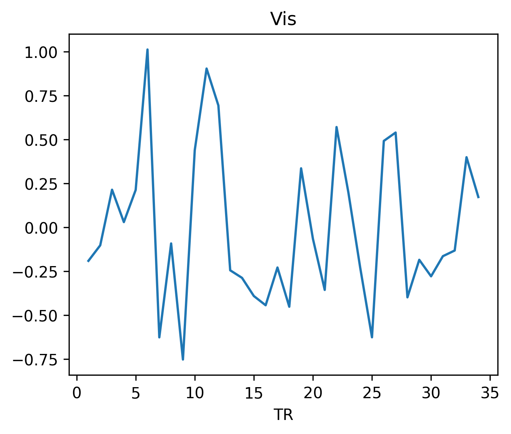
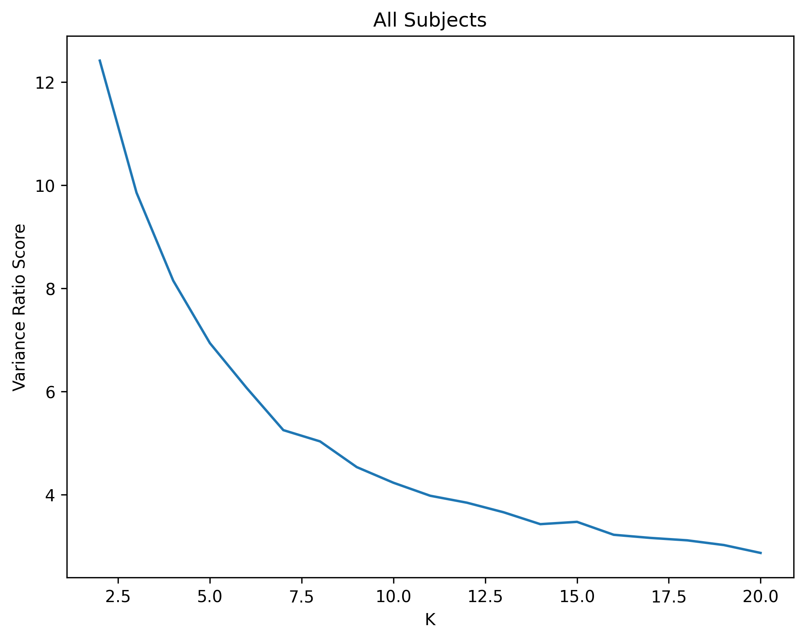
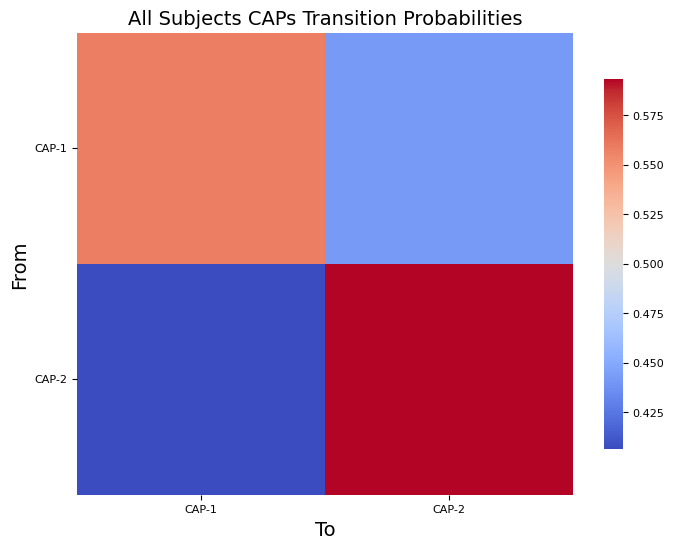
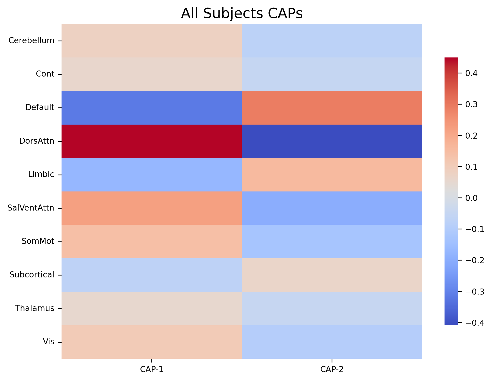
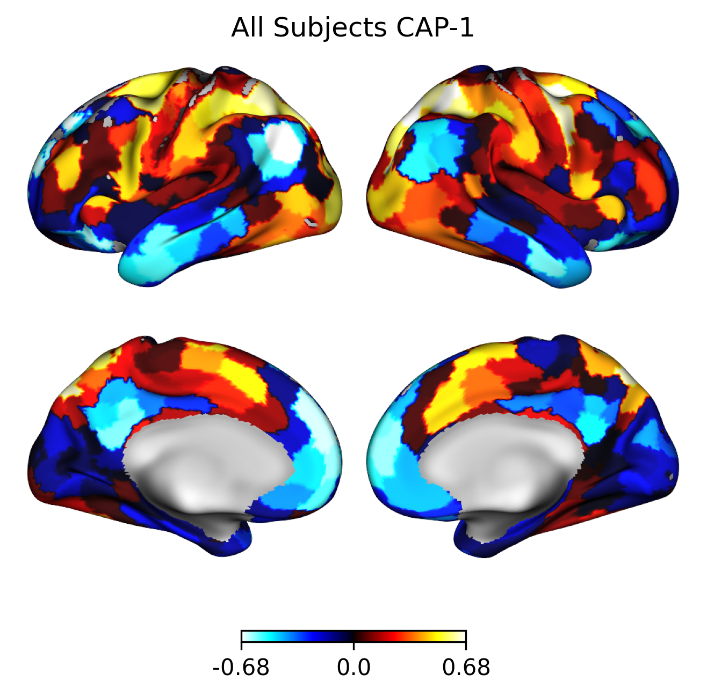
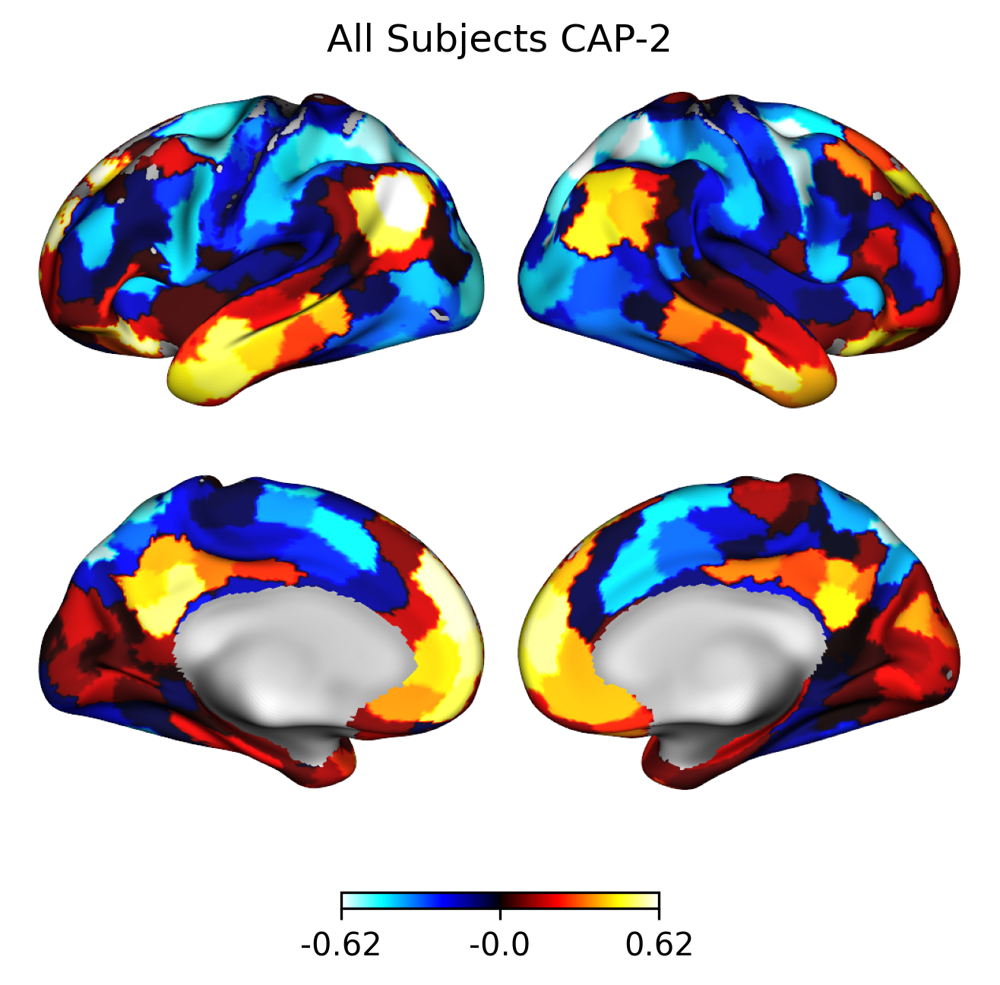
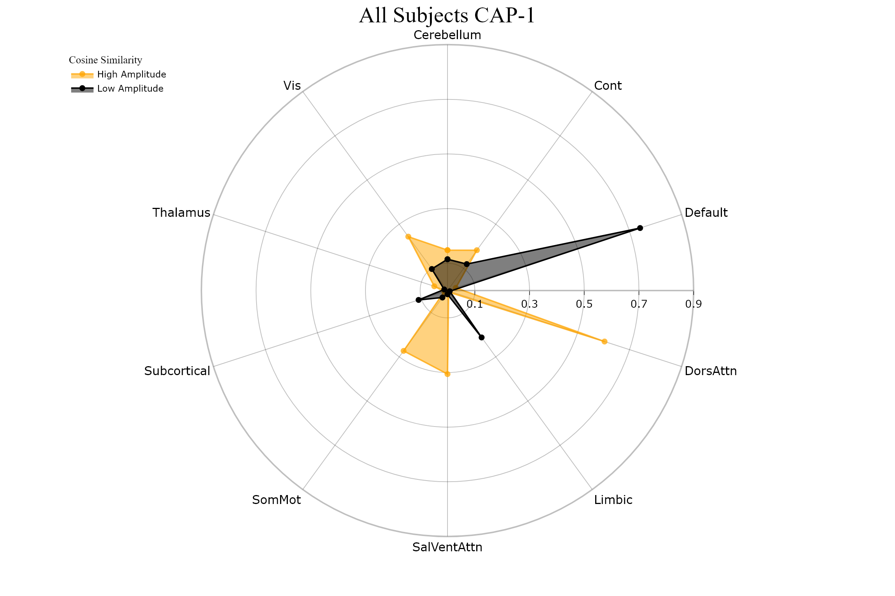
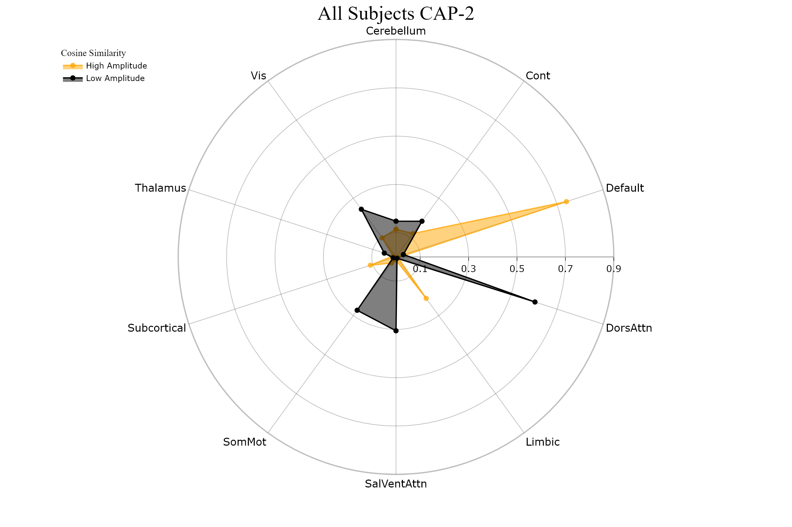

Tutorial 8: Workflow Example
============================

.. |colab| image:: https://colab.research.google.com/assets/colab-badge.svg
   :target: https://colab.research.google.com/github/donishadsmith/neurocaps/blob/stable/docs/examples/notebooks/workflow.ipynb

|colab|

This tutorial demonstrates an example workflow from timeseries extraction to CAPs visualization.
Two subjects from a real, publicly available dataset are used so it may take a few minutes
to download the files.

.. code-block:: python

    import os

    demo_dir = "neurocaps_demo"
    os.makedirs(demo_dir, exist_ok=True)

The code below fetches two subjects from an `OpenNeuro dataset <https://openneuro.org/datasets/ds005381/versions/1.0.0>`_
preprocessed with `fMRIPrep <https://fmriprep.org/en/stable/>`_. Downloading data from OpenNeuro requires
``pip install openneuro-py ipywidgets`` or ``pip install neurocaps[demo]``.

.. code-block:: python

    # [Dataset] doi: doi:10.18112/openneuro.ds005381.v1.0.0
    from openneuro import download

    # Include the run-1 and run-2 data from two subjects
    include = [
        "dataset_description.json",
        "sub-0004/ses-2/func/*run-[12]*events*",
        "derivatives/fmriprep/sub-0004/fmriprep/sub-0004/ses-2/func/*run-[12]*confounds_timeseries*",
        "derivatives/fmriprep/sub-0004/fmriprep/sub-0004/ses-2/func/*run-[12]_space-MNI152NLin*preproc_bold*",
        "sub-0006/ses-2/func/*run-[12]*events*",
        "derivatives/fmriprep/sub-0006/fmriprep/sub-0006/ses-2/func/*run-[12]*confounds_timeseries*",
        "derivatives/fmriprep/sub-0006/fmriprep/sub-0006/ses-2/func/*run-[12]_space-MNI152NLin*preproc_bold*",
    ]

    download(
        dataset="ds005381",
        include=include,
        target_dir=demo_dir,
        verify_hash=False,
    )

The first level of the pipeline directory must also have a "dataset_description.json" file for querying purposes.

.. code-block:: python

    import json

    desc = {
        "Name": "fMRIPrep - fMRI PREProcessing workflow",
        "BIDSVersion": "1.0.0",
        "DatasetType": "derivative",
        "GeneratedBy": [
            {"Name": "fMRIPrep", "Version": "20.2.0", "CodeURL": "https://github.com/nipreps/fmriprep"}
        ],
    }

    with open(
        "neurocaps_demo/derivatives/fmriprep/dataset_description.json", "w", encoding="utf-8"
    ) as f:
        json.dump(desc, f)

.. code-block:: python

    from neurocaps.extraction import TimeseriesExtractor
    from neurocaps.utils import fetch_preset_parcel_approach

    # List of fMRIPrep-derived confounds for nuisance regression
    confound_names = [
        "cosine*",
        "trans_x",
        "trans_x_derivative1",
        "trans_y",
        "trans_y_derivative1",
        "trans_z",
        "trans_z_derivative1",
        "rot_x",
        "rot_x_derivative1",
        "rot_y",
        "rot_y_derivative1",
        "rot_z",
        "rot_z_derivative1",
        "a_comp_cor_00",
        "a_comp_cor_01",
        "a_comp_cor_02",
        "a_comp_cor_03",
        "a_comp_cor_04",
        "global_signal",
        "global_signal_derivative1",
    ]

    # Initialize extractor with signal cleaning parameters
    extractor = TimeseriesExtractor(
        space="MNI152NLin6Asym",
        parcel_approach=fetch_preset_parcel_approach("4S", n_nodes=456),
        standardize=True,
        confound_names=confound_names,
        fd_threshold={
            "threshold": 0.50,
            "outlier_percentage": 0.30,
        },
    )

    # Extract BOLD data from preprocessed fMRIPrep data
    # which should be located in the "derivatives" folder
    # within the BIDS root directory
    # The extracted timeseries data is automatically stored
    # Session 2 is the only session available, so `session`
    # does not need to be specified
    extractor.get_bold(
        bids_dir=demo_dir,
        task="DET",
        condition="late",
        condition_tr_shift=4,
        tr=2,
        verbose=False,
    ).timeseries_to_pickle(demo_dir, "timeseries.pkl")

.. rst-class:: sphx-glr-script-out

    .. code-block:: none

        2025-07-08 08:21:36,497 neurocaps.extraction._internals.confounds [INFO] Confound regressors to be used if available: cosine*, trans_x, trans_x_derivative1, trans_y, trans_y_derivative1, trans_z, trans_z_derivative1, rot_x, rot_x_derivative1, rot_y, rot_y_derivative1, rot_z, rot_z_derivative1, a_comp_cor_00, a_comp_cor_01, a_comp_cor_02, a_comp_cor_03, a_comp_cor_04, global_signal, global_signal_derivative1.
        2025-07-08 08:21:38,133 neurocaps.extraction.timeseries_extractor [INFO] BIDS Layout: ...mples\notebooks\neurocaps_demo | Subjects: 2 | Sessions: 2 | Runs: 4

.. code-block:: python

    # Retrieve the dataframe containing QC information for each subject
    # to use for downstream statistical analyses
    qc_df = extractor.report_qc()
    print(qc_df)

.. csv-table::
   :file: embed/report_qc-workflow.csv
   :header-rows: 1

.. code-block:: python

    # Visualize BOLD Data
    extractor.visualize_bold(subj_id="0004", run=1, region="Vis", figsize=(5, 4))

.. code-block:: python

    from neurocaps.analysis import CAP

    # Initialize CAP class
    cap_analysis = CAP(parcel_approach=extractor.parcel_approach)

    # Identify the optimal number of CAPs (clusters)
    # using the variance_ratio method to test 2-10
    # The optimal number of CAPs is automatically stored
    cap_analysis.get_caps(
        subject_timeseries=extractor.subject_timeseries,
        n_clusters=range(2, 10),
        standardize=True,
        cluster_selection_method="variance_ratio",
        max_iter=500,
        n_init=10,
        random_state=0,
        show_figs=True,
    )

.. rst-class:: sphx-glr-script-out

    .. code-block:: none

        2025-07-08 08:22:00,439 neurocaps.analysis.cap._internals.cluster [INFO] No groups specified. Using default group 'All Subjects' containing all subject IDs from `subject_timeseries`. The `groups` dictionary will remain fixed unless the `CAP` class is re-initialized or `clear_groups()` is used.
        2025-07-08 08:22:01,315 neurocaps.analysis.cap._internals.cluster [INFO] [GROUP: All Subjects | METHOD: variance_ratio] Optimal cluster size is 2.

.. code-block:: python

    # Calculate temporal fraction and transition probability of each CAP for all subjects
    output = cap_analysis.calculate_metrics(
        extractor.subject_timeseries, metrics=["temporal_fraction", "transition_probability"]
    )
    print(output["temporal_fraction"])

.. csv-table::
   :file: embed/temporal_fraction-workflow.csv
   :header-rows: 1

.. code-block:: python

    # Averaged transition probability matrix
    from neurocaps.analysis import transition_matrix

    transition_matrix(output["transition_probability"])

.. code-block:: python

    cap_analysis.caps2plot(plot_options="heatmap")

.. code-block:: python

    # Project CAPs onto surface plots
    # and generate cosine similarity network alignment of CAPs

    radialaxis = {
        "showline": True,
        "linewidth": 2,
        "linecolor": "rgba(0, 0, 0, 0.25)",
        "gridcolor": "rgba(0, 0, 0, 0.25)",
        "ticks": "outside",
        "tickfont": {"size": 14, "color": "black"},
        "range": [0, 0.5],
        "tickvals": [0.1, "", 0.3, "", 0.5],
    }

    color_discrete_map = {
        "High Amplitude": "rgba(255, 165, 0, 0.75)",
        "Low Amplitude": "black",
    }

    cap_analysis.caps2surf(color_range=(1, 1)).caps2radar(
        radialaxis=radialaxis, color_discrete_map=color_discrete_map
    )

.. only:: html

  .. container:: sphx-glr-footer sphx-glr-footer-example

    .. container:: sphx-glr-download sphx-glr-download-jupyter

      :download:`Download Jupyter Notebook <notebooks/workflow.ipynb>`
