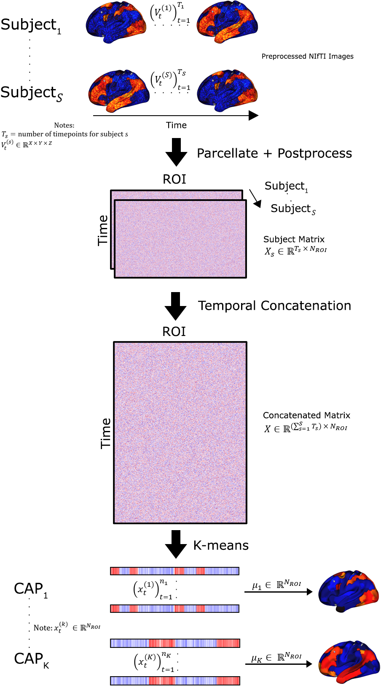

**NeuroCAPs: Neuroimaging Co-Activation Patterns**
==================================================
.. image:: https://img.shields.io/pypi/v/neurocaps.svg
   :target: https://pypi.python.org/pypi/neurocaps/
   :alt: Latest Version

.. image:: https://img.shields.io/pypi/pyversions/neurocaps.svg
   :target: https://pypi.python.org/pypi/neurocaps/
   :alt: Python Versions

.. image:: https://img.shields.io/badge/DOI-10.5281%2Fzenodo.11642615-teal
   :target: https://doi.org/10.5281/zenodo.15824018
   :alt: DOI

.. image:: https://img.shields.io/badge/Source%20Code-neurocaps-purple
   :target: https://github.com/donishadsmith/neurocaps
   :alt: GitHub Repository

.. image:: https://github.com/donishadsmith/neurocaps/actions/workflows/testing.yaml/badge.svg
   :target: https://github.com/donishadsmith/neurocaps/actions/workflows/testing.yaml
   :alt: Test Status

.. image:: https://codecov.io/github/donishadsmith/neurocaps/graph/badge.svg?token=WS2V7I16WF
   :target: https://codecov.io/github/donishadsmith/neurocaps
   :alt: codecov

.. image:: https://img.shields.io/badge/License-MIT-blue.svg
   :target: https://opensource.org/licenses/MIT
   :alt: License

.. image:: https://img.shields.io/badge/OS-Ubuntu%20|%20macOS%20|%20Windows-blue
  :alt: Platform Support

.. image:: https://img.shields.io/badge/docker-donishadsmith/neurocaps-darkblue.svg?logo=docker&style=round
   :target: https://hub.docker.com/r/donishadsmith/neurocaps/tags/
   :alt: Docker

.. image:: https://joss.theoj.org/papers/0e5c44d5d82402fa0f28e6a8833428f0/status.svg
   :target: https://joss.theoj.org/papers/0e5c44d5d82402fa0f28e6a8833428f0
   :alt: JOSS

NeuroCAPs (**Neuro**\ imaging **C**\ o-**A**\ ctivation **P**\ attern\ **s**) is a Python package for performing
Co-Activation Patterns (CAPs) analyses on resting-state or task-based fMRI data. CAPs identifies recurring brain states
by applying k-means clustering on BOLD timeseries data [1]_.

Citing
------
::

  Smith, D. (2024). NeuroCAPs. Zenodo. https://doi.org/10.5281/zenodo.15824018

Usage
-----
NeuroCAPs is built around two main classes (``TimeseriesExtractor`` and ``CAP``) and includes several
features to perform the complete CAPs workflow from postprocessing to visualizations.
Notable features includes:

- Timeseries Extraction (``TimeseriesExtractor``):

  - extracts BOLD timeseries from resting-state or task-based fMRI data.
  - supports deterministic parcellations such as the Schaefer and AAL, in addition to custom-defined deterministic parcellations.
  - performs nuisance regression, motion scrubbing, and additional features
  - reports quality control information based on framewise displacement

  .. important::
      NeuroCAPs is most optimized for fMRI data preprocessed with
      [fMRIPrep](https://fmriprep.org/en/stable/) and assumes the data is BIDs compliant.
      Refer to [NeuroCAPs' BIDS Structure and Entities Documentation](https://neurocaps.readthedocs.io/en/stable/bids.html)
      for additional information.

- CAP Analysis (``CAP``):

  - performs k-means clustering on individuals or groups
  - identifies the optimal number of clusters using silhouette, elbow, davies bouldin, or variance ratio methods
  - computes several temporal dynamic metrics [2]_ [3]_:
      - temporal fraction (fraction of time)
      - persistence (dwell time)
      - counts (state initiation)
      - transition frequency & probability
  - produces several visualizations:
      - heatmaps and outer product plots
      - surface plots
      - correlation matrices
      - cosine similarity radar plots [4]_ [5]_

- Utilities:

  - plot transition matrices
  - merges timeseries data across tasks or session
  - generates the custom parcellation dictionary structure from the parcellation's metadata file

Refer to the demos to the `demos <https://github.com/donishadsmith/neurocaps/tree/main/demos>`_ or
`tutorials <https://neurocaps.readthedocs.io/en/latest/examples/examples.html>`_ for an
extensive demonstration of the features included in this package.

Dependencies
------------
NeuroCAPs relies on several packages:

::

   dependencies = [
      "numpy>=1.26.3",
      "pandas>=2.1.0",
      "joblib>=1.3.0",
      "matplotlib>=3.6.0",
      "seaborn>=0.11.0",
      "kneed>=0.8.5",
      "nibabel>=5.0.0",
      "nilearn>=0.10.4",
      "scikit-learn>=1.4.0",
      "scipy>=1.10.0",
      "brainspace>=0.1.16",
      "surfplot>=0.2.0",
      "neuromaps>=0.0.5",
      "pybids>=0.16.5; platform_system != 'Windows'",
      "plotly>=5.19.0, !=6.1.0, <=6.1.2",
      "nbformat>=5.10.0",
      "kaleido==0.1.0.post1; platform_system == 'Windows'",
      "kaleido>=0.2.0, <1.0.0; platform_system != 'Windows'",
      "setuptools>=77.0.1; python_version>='3.12'",
      "typing_extensions>=4.10.0",
      "vtk>=9.2.0, <9.4.0",
      "tqdm>=4.65.0"
      ]

Acknowledgements
----------------
Some foundational concepts in NeuroCAPs take inspiration from features or design patterns
implemented in other neuroimaging Python packages, specifically:

- mtorabi59's `pydfc <https://github.com/neurodatascience/dFC>`_, a toolbox that allows comparisons
among several popular dynamic functionality methods.
- 62442katieb's `IDConn <https://github.com/62442katieb/IDConn>`_, a pipeline for assessing
individual differences in resting-state or task-based functional connectivity.

References
----------
.. [1] Liu, X., Chang, C., & Duyn, J. H. (2013). Decomposition of spontaneous brain activity into
distinct fMRI co-activation patterns. Frontiers in Systems Neuroscience, 7.
https://doi.org/10.3389/fnsys.2013.00101

.. [2] Liu, X., Zhang, N., Chang, C., & Duyn, J. H. (2018). Co-activation patterns in resting-state
       fMRI signals. NeuroImage, 180, 485–494. https://doi.org/10.1016/j.neuroimage.2018.01.041

.. [3] Yang, H., Zhang, H., Di, X., Wang, S., Meng, C., Tian, L., & Biswal, B. (2021). Reproducible
       coactivation patterns of functional brain networks reveal the aberrant dynamic state
       transition in schizophrenia. NeuroImage, 237, 118193. https://doi.org/10.1016/j.neuroimage.2021.118193

.. [4] Zhang, R., Yan, W., Manza, P., Shokri-Kojori, E., Demiral, S. B., Schwandt, M., Vines, L.,
       Sotelo, D., Tomasi, D., Giddens, N. T., Wang, G., Diazgranados, N., Momenan, R., & Volkow, N. D. (2023).
       Disrupted brain state dynamics in opioid and alcohol use disorder: attenuation by nicotine use.
       Neuropsychopharmacology, 49(5), 876–884. https://doi.org/10.1038/s41386-023-01750-w

.. [5] Ingwersen, T., Mayer, C., Petersen, M., Frey, B. M., Fiehler, J., Hanning, U., Kühn, S.,
       Gallinat, J., Twerenbold, R., Gerloff, C., Cheng, B., Thomalla, G., & Schlemm, E. (2024).
       Functional MRI brain state occupancy in the presence of cerebral small vessel disease — A
       pre-registered replication analysis of the Hamburg City Health Study. Imaging Neuroscience,
       2, 1–17. https://doi.org/10.1162/imag_a_00122

.. [6] Kupis, L., Romero, C., Dirks, B., Hoang, S., Parladé, M. V., Beaumont, A. L., Cardona, S. M.,
       Alessandri, M., Chang, C., Nomi, J. S., & Uddin, L. Q. (2020). Evoked and intrinsic brain network
       dynamics in children with autism spectrum disorder. NeuroImage: Clinical, 28, 102396.
       https://doi.org/10.1016/j.nicl.2020.102396
