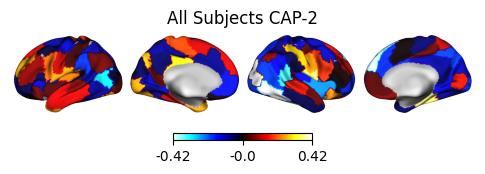

# Summary
Co-Activation Patterns (CAPs) is a dynamic functional connectivity technique that clusters similar
spatial distributions of brain activity. To make this analytical technique more accessible to
neuroimaging researchers, NeuroCAPs, an open source Python package, was developed. This package
performs end-to-end CAPs analyses on preprocessed resting-state or task-based functional magnetic
resonance imaging (fMRI) data, and is most optimized for data preprocessed with fMRIPrep, a robust
preprocessing pipeline designed to minimize manual user input and enhance reproducibility
[@Esteban2019].

# Background
Numerous fMRI studies employ static functional connectivity (sFC) techniques to analyze correlative
activity within and between brain regions. However, these approaches operate under the assumption
that functional connectivity patterns, which change within seconds [@Jiang2022], remain stationary
throughout the entire data acquisition period [@Hutchison2013].

Unlike sFC approaches, dynamic functional connectivity (dFC) methods enable the analysis of dynamic
functional states, which are characterized by consistent, replicable, and distinct periods of
time-varying brain connectivity patterns [@Rabany2019]. Among these techniques, CAPs analysis
aggregates similar spatial distributions of brain activity using clustering techniques, typically
the k-means algorithm, to capture the dynamic nature of brain activity [@Liu2013; @Liu2018].

# Statement of Need
The typical CAPs workflow can be programmatically time-consuming to manually orchestrate as it
generally entails several steps:

1. implement spatial dimensionality reduction of timeseries data using a parcellation
2. perform nuisance regression and scrub high-motion volumes (excessive head motion)
3. concatenate the timeseries data from multiple subjects into a single matrix
4. apply k-means clustering to the concatenated data and select the optimal number of
   clusters (CAPs) using heuristics such as the elbow or silhouette methods
5. generate different visualizations to enhance the interpretability of the CAP

While other excellent CAPs toolboxes exist, they are often implemented in proprietary languages such
as MATLAB (which is the case for TbCAPs [@Bolton2020]), lack comprehensive end-to-end analytical
pipelines for both resting-state and task-based fMRI data with temporal dynamic metrics and
visualization capabilities (such as capcalc [@Frederick2022]), or are comprehensive, but generalized
toolboxes for evaluating and comparing different dFC methods (such as pydFC [@Torabi2024]).

NeuroCAPs addresses these limitations by providing an accessible Python package specifically
for performing end-to-end CAPs analyses, from post-processing of fMRI data to creation of temporal
metrics for downstream statistical analyses and visualizations to facilitate interpretations.
However, many of NeuroCAPs' post-processing functionalities assumes that fMRI data is organized in
a Brain Imaging Data Structure (BIDS) compliant directory and is most optimized for data
preprocessed with fMRIPrep [@Esteban2019] or preprocessing pipelines that generate similar
outputs (e.g. NiBabies [@Goncalves2025]). Furthermore, NeuroCAPs only supports the k-means
algorithm for clustering, which is the clustering algorithm that was originally used and is often
employed when performing the CAPs analysis [@Liu2013].

# Usage
The following code demonstrates basic usage of NeuroCAPs (with simulated data) to perform CAPs analysis
. A version of this example using real data is available on
[NeuroCAPs' readthedocs](https://neurocaps.readthedocs.io/en/stable/tutorials/tutorial-8.html).

1. Extract timeseries data
```python
import numpy as np

from neurocaps.extraction import TimeseriesExtractor
from neurocaps.utils import simulate_bids_dataset

# Set seed
np.random.seed(0)

# Generate a BIDS directory with fMRIPrep derivatives
bids_root = simulate_bids_dataset(n_subs=3, n_runs=1, n_volumes=100, task_name="rest")

# Using Schaefer, one of the default parcellation approaches
parcel_approach = {"Schaefer": {"n_rois": 100, "yeo_networks": 7}}

# List of fMRIPrep-derived confounds for nuisance regression
acompcor_names = [f"a_comp_cor_0{i}" for i in range(5)]
confound_names = ["cosine*", "trans*", "rot*", *acompcor_names]

# Initialize extractor with signal cleaning parameters
extractor = TimeseriesExtractor(
    space="MNI152NLin2009cAsym",
    parcel_approach=parcel_approach,
    confound_names=confound_names,
    standardize=False,
    # Run discarded if more than 30% of volumes exceed FD threshold
    fd_threshold={"threshold": 0.90, "outlier_percentage": 0.30},
)

# Extract preprocessed BOLD data
extractor.get_bold(bids_dir=bids_root, task="rest", tr=2, n_cores=1, verbose=False)

# Check QC information
qc_df = extractor.report_qc()
print(qc_df)
```

| Subject_ID | Run | Mean_FD | Std_FD | Frames_Scrubbed | ... |
|------------|-----|---------|--------|-----------------|-----|
| 0 | run-0 | 0.516349 | 0.289657 |  9 | ... |
| 1 | run-0 | 0.526343 | 0.297550 | 17 | ... |
| 2 | run-0 | 0.518041 | 0.273964 |  8 | ... |

2. Use k-means clustering to identify the optimal number of CAPs from the data using a heuristic
```python
from neurocaps.analysis import CAP
from neurocaps.utils import PlotDefaults

# Initialize CAP class
cap_analysis = CAP(parcel_approach=extractor.parcel_approach, groups=None)

plot_kwargs = {**PlotDefaults.get_caps(), "figsize": (4, 3), "step": 2}

# Find optimal CAPs (2-20) using silhouette method; results are stored
cap_analysis.get_caps(
    subject_timeseries=extractor.subject_timeseries,
    n_clusters=range(2, 21),
    standardize=True,
    cluster_selection_method="silhouette",
    max_iter=500,
    n_init=10,
    show_figs=True,
    **plot_kwargs,
)
```


3. Compute temporal dynamic metrics for downstream statistical analyses
```python
# Calculate temporal fraction of each CAP
metric_dict = cap_analysis.calculate_metrics(
    extractor.subject_timeseries, metrics=["temporal_fraction"]
)
print(metric_dict["temporal_fraction"])
```

| Subject_ID | Group | Run | CAP-1 | CAP-2 |
|------------|-------|-----|-------|-------|
| 0 | All Subjects | run-0 | 0.505495 | 0.494505 |
| 1 | All Subjects | run-0 | 0.530120 | 0.469880 |
| 2 | All Subjects | run-0 | 0.521739 | 0.478261 |

Note that CAP-1 is the dominant brain state across subjects (highest frequency).

4. Visualize CAPs
```python
# Create surface and radar plots for each CAP
surface_kwargs = {**PlotDefaults.caps2surf(), "layout": "row", "size": (500, 100)}

radar_kwargs = {**PlotDefaults.caps2radar(), "height": 400, "width": 485}
radar_kwargs["radialaxis"] = {"range": [0, 0.4], "tickvals": [0.1, "", "", 0.4]}
radar_kwargs["legend"] = {"yanchor": "top", "y": 0.75, "x": 1.15}

cap_analysis.caps2surf(**surface_kwargs).caps2radar(**radar_kwargs)
```





Radar plots show network alignment (measured by cosine similarity): "High Amplitude" =
alignment to activations (> 0), "Low Amplitude" = alignment to deactivations (< 0).

Each CAP can be characterized using either maximum alignment
(CAP-1: Vis+/SomMot-; CAP-2: SomMot+/Vis-) or predominant alignment ("High Amplitude" − "Low Amplitude";
CAP-1: SalVentAttn+/SomMot-; CAP-2: SomMot+/SalVentAttn-).

```python
import pandas as pd

for cap_name in cap_analysis.caps["All Subjects"]:
    df = pd.DataFrame(cap_analysis.cosine_similarity["All Subjects"][cap_name])
    df["Net"] = df["High Amplitude"] - df["Low Amplitude"]
    df["Regions"] = cap_analysis.cosine_similarity["All Subjects"]["Regions"]
    print(f"{cap_name}:", "\n", df, "\n")
```
CAP-1:

| High Amplitude | Low Amplitude | Net | Regions |
|----------------|---------------|-----|---------|
| 0.340826 | 0.309850 | 0.030976 | Vis |
| 0.155592 | 0.318072 | -0.162480 | SomMot |
| 0.213348 | 0.181667 | 0.031681  | DorsAttn |
| 0.287179 | 0.113046 | 0.174133  | SalVentAttn |
| 0.027542 | 0.168325 | -0.140783 | Limbic |
| 0.236915 | 0.195235 | 0.041680  | Cont |
| 0.238242 | 0.208548 | 0.029694 | Default |


CAP-2:

| High Amplitude | Low Amplitude | Net | Regions |
|----------------|---------------|-----|---------|
| 0.309850 | 0.340826 | -0.030976 | Vis |
| 0.318072 | 0.155592 | 0.162480  | SomMot |
| 0.181667 | 0.213348 | -0.031681 | DorsAttn |
| 0.113046 | 0.287179 | -0.174133 | SalVentAttn |
| 0.168325 | 0.027542 | 0.140783  | Limbic |
| 0.195235 | 0.236915 | -0.041680 | Cont |
| 0.208548 | 0.230242 | -0.021694 | Default |

# Documentation
Comprehensive documentations and interactive tutorials of NeuroCAPS can be found at
[https://neurocaps.readthedocs.io/](https://neurocaps.readthedocs.io/) and on its
[repository](https://github.com/donishadsmith/neurocaps).

# Acknowledgements
Funding provided by the Dissertation Year Fellowship (DYF) Program at Florida International
University (FIU) assisted in further refinement and expansion of NeuroCAPs.

# References
