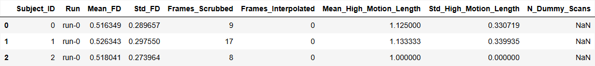
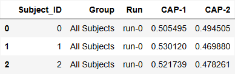
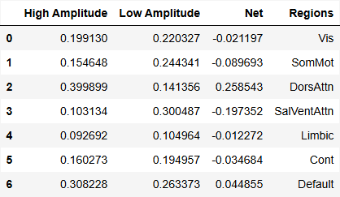

# Summary
Co-Activation Patterns (CAPs) is a dynamic functional connectivity technique that clusters similar
spatial distributions of brain activity. NeuroCAPs is an open-source Python package that makes CAPs
analysis accessible to neuroimaging researchers for preprocessed resting-state or task-based fMRI
data. The package is optimized for fMRIPrep-preprocessed data [@Esteban2019], leveraging fMRIPrep's
robust, BIDS-compliant outputs.

# Background
Numerous fMRI studies employ static functional connectivity (sFC) techniques to analyze correlative
activity within and between brain regions. However, these approaches assume functional connectivity
patterns, which change within seconds [@Jiang2022], remain stationary throughout the entire data
acquisition period [@Hutchison2013].

Unlike sFC approaches, dynamic functional connectivity (dFC) methods enable the analysis of dynamic
functional states, which are characterized by consistent, replicable, and distinct periods of
time-varying brain connectivity patterns [@Rabany2019]. Among these techniques, CAPs analysis
aggregates similar spatial distributions of brain activity using a clustering algorithm
(i.e., k-means) to capture the dynamic nature of brain activity [@Liu2013; @Liu2018].

# Statement of Need
The CAPs workflow can be programmatically time-consuming as researchers must:

1. apply spatial dimensionality reduction to timeseries data
2. perform nuisance regression and remove high-motion volumes
3. concatenate timeseries data from multiple subjects into a single matrix
4. implement k-means clustering with optimal cluster selection
5. generate visualizations for CAP interpretation

While excellent CAPs toolboxes exist, they are often implemented in proprietary languages such
as MATLAB (TbCAPs [@Bolton2020]), lack comprehensive end-to-end analytical
pipelines for both resting-state and task-based fMRI data with temporal dynamic metrics and
visualization capabilities (capcalc [@Frederick2022]), or are comprehensive, but generalized
toolboxes for evaluating and comparing different dFC methods (pydFC [@Torabi2024]).

NeuroCAPs provides an accessible Python package for end-to-end CAPs analysis, spanning fMRI
post-processing through computation of temporal metrics and creation of visualizations. However,
many of NeuroCAPs' post-processing functionalities assumes that fMRI data is organized in a BIDS
compliant directory [@Yarkoni2019] and is optimized for fMRIPrep [@Esteban2019] or fMRIPrep-like
pipelines such as NiBabies [@Goncalves2025]. Furthermore, NeuroCAPs is limited to the k-means
algorithm for clustering, a choice that aligns with the original CAPs methodology [@Liu2013] and its
prevalence in the CAPs literature.

# Modules
The core functionalities of NeuroCAPs are concentrated in three modules:

1. `neurocaps.extraction` contains the `TimeseriesExtractor` class, which:

- leverages Nilearn's [@Nilearn] `NiftiLabelsMasker` for denoising and
  spatial dimensionality reduction using deterministic parcellations (e.g.,
  Schaefer [@Schaefer2018], AAL [@Tzourio-Mazoyer2002], etc)
- removes high-motion volumes using fMRIPrep-derived framewise displacement (FD) values
- reports quality control metrics for motion and non-steady state volumes

2. `neurocaps.analysis` contains the `CAP` class for performing the CAPs analysis, as well as
   standalone functions.

- The `CAP` class:
  - identifies CAPs via k-means clustering [@scikit-learn] with optimized cluster selection (e.g.,
    silhouette, elbow [@Arvai2023], etc)
  - computes subject-level temporal metrics (e.g., temporal fraction, transition probabilities, etc)
  - converts CAPs to NIfTI statistical maps
  - integrates multiple plotting libraries [@Hunter:2007; @Waskom2021; @plotly; @Gale2021] for
    diverse visualizations

- Standalone functions: provides tools for within-run regions-of-interest standardization
[@harris2020array], merging timeseries across sessions/tasks and creating group-averaged transition
matrices.

3. `neurocaps.utils` contains utility functions for:

- fetching non-default (i.e., Schaefer and AAL) preset parcellation approaches
  (i.e., 4S, HCPex [@Huang2022], and Gordon [@Gordon2016])
- generating custom parcellation approaches from tabular metadata
- customizing plots and simulating data

# Workflow
The following code demonstrates basic usage of NeuroCAPs (with simulated data) to perform CAPs analysis,
[a version using real data is also available](https://neurocaps.readthedocs.io/en/stable/tutorials/tutorial-8.html).

1. Extract timeseries data
```python
import numpy as np
from neurocaps.extraction import TimeseriesExtractor
from neurocaps.utils import simulate_bids_dataset

# Set seed
np.random.seed(0)

# Generate a BIDS directory with fMRIPrep derivatives
bids_root = simulate_bids_dataset(n_subs=3, n_runs=1, n_volumes=100, task_name="rest")

# Set the parcel approach
parcel_approach = {"Schaefer": {"n_rois": 100, "yeo_networks": 7}}

# List of fMRIPrep-derived confounds for nuisance regression
acompcor_names = [f"a_comp_cor_0{i}" for i in range(5)]
confound_names = ["cosine*", "trans*", "rot*", *acompcor_names]

# Initialize extractor with signal cleaning parameters
extractor = TimeseriesExtractor(
    space="MNI152NLin2009cAsym",
    parcel_approach=parcel_approach,
    confound_names=confound_names,
    standardize=False,
    # Run discarded if >30% of volumes exceed FD threshold
    fd_threshold={"threshold": 0.90, "outlier_percentage": 0.30},
)

# Extract timeseries
extractor.get_bold(bids_dir=bids_root, task="rest", tr=2, n_cores=1, verbose=False)

# Check QC information
qc_df = extractor.report_qc()
print(qc_df)
```


2. Use k-means clustering to identify the optimal number of CAPs from the data using a heuristic
```python
from neurocaps.analysis import CAP
from neurocaps.utils import PlotDefaults

cap_analysis = CAP(parcel_approach=extractor.parcel_approach, groups=None)

plot_kwargs = {**PlotDefaults.get_caps(), "figsize": (4, 3), "step": 2}

# Find optimal CAPs (2-20) using silhouette method; results are stored
cap_analysis.get_caps(
    subject_timeseries=extractor.subject_timeseries,
    n_clusters=range(2, 21),
    standardize=True,
    cluster_selection_method="silhouette",
    max_iter=500,
    n_init=10,
    show_figs=True,
    **plot_kwargs,
)
```
{width="50%"}

3. Compute temporal dynamic metrics for downstream statistical analyses
```python
metric_dict = cap_analysis.calculate_metrics(
    extractor.subject_timeseries, metrics=["temporal_fraction"]
)
print(metric_dict["temporal_fraction"])
```
{width="50%"}

Note that CAP-1 is the dominant brain state across subjects (highest frequency).

4. Visualize CAPs
```python
surface_kwargs = {**PlotDefaults.caps2surf(), "layout": "row", "size": (500, 100)}

radar_kwargs = {**PlotDefaults.caps2radar(), "height": 400, "width": 485}
radar_kwargs["radialaxis"] = {"range": [0, 0.4], "tickvals": [0.1, "", "", 0.4]}
radar_kwargs["legend"] = {"yanchor": "top", "y": 0.75, "x": 1.15}

cap_analysis.caps2surf(**surface_kwargs).caps2radar(**radar_kwargs)
```
{width="50%"}

{width="50%"}

{width="50%"}

{width="50%"}

Radar plots show network alignment (measured by cosine similarity): "High Amplitude" represents
alignment to activations (> 0), "Low Amplitude" represents alignment to deactivations (< 0).

Each CAP can be characterized using either maximum alignment
(CAP-1: Vis+/SomMot-; CAP-2: SomMot+/Vis-) or predominant alignment ("High Amplitude" −
"Low Amplitude"; CAP-1: SalVentAttn+/SomMot-; CAP-2: SomMot+/SalVentAttn-).

```python
import pandas as pd

for cap_name in cap_analysis.caps["All Subjects"]:
    df = pd.DataFrame(cap_analysis.cosine_similarity["All Subjects"][cap_name])
    df["Net"] = df["High Amplitude"] - df["Low Amplitude"]
    df["Regions"] = cap_analysis.cosine_similarity["All Subjects"]["Regions"]
    print(df, "\n")
```
{width="50%"}

{width="50%"}

# Documentation
Comprehensive documentation and tutorials can be found at
[https://neurocaps.readthedocs.io/](https://neurocaps.readthedocs.io/) and
[https://github.com/donishadsmith/neurocaps](https://github.com/donishadsmith/neurocaps).

# Acknowledgements
Funding from the Dissertation Year Fellowship Program at Florida International University supported
NeuroCAPs' refinement and expansion.

# References
