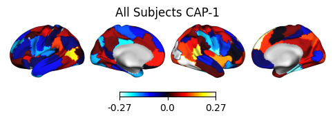

# Summary
Co-Activation Patterns (CAPs) is a dynamic functional connectivity technique that clusters similar
spatial distributions of brain activity. To make this analytical technique more accessible to
neuroimaging researchers, NeuroCAPs, an open source Python package, was developed. This package
performs end-to-end CAPs analyses on preprocessed resting-state or task-based functional magnetic
resonance imaging (fMRI) data, and is most optimized for data preprocessed with fMRIPrep, a robust
preprocessing pipeline designed to minimize manual user input and enhance reproducibility
[@Esteban2019].

# Background
Numerous fMRI studies employ static functional connectivity (sFC) techniques to analyze correlative
activity within and between brain regions. However, these approaches operate under the assumption
that functional connectivity patterns, which change within seconds [@Jiang2022], remain stationary
throughout the entire data acquisition period [@Hutchison2013].

Unlike sFC approaches, dynamic functional connectivity (dFC) methods enable the analysis of dynamic
functional states, which are characterized by consistent, replicable, and distinct periods of
time-varying brain connectivity patterns [@Rabany2019]. Among these techniques, CAPs analysis
aggregates similar spatial distributions of brain activity using clustering techniques, typically
the k-means algorithm, to capture the dynamic nature of brain activity [@Liu2013; @Liu2018].

# Statement of Need
The typical CAPs workflow can be programmatically time-consuming to manually orchestrate as it
generally entails several steps:

1. implement spatial dimensionality reduction of timeseries data
2. perform nuisance regression and scrub high-motion volumes (excessive head motion)
3. concatenate the timeseries data from multiple subjects into a single matrix
4. apply k-means clustering to the concatenated data and select the optimal number of
   clusters (CAPs) using heuristics such as the elbow or silhouette methods
5. generate different visualizations to enhance the interpretability of the CAP

While other excellent CAPs toolboxes exist, they are often implemented in proprietary languages such
as MATLAB (which is the case for TbCAPs [@Bolton2020]), lack comprehensive end-to-end analytical
pipelines for both resting-state and task-based fMRI data with temporal dynamic metrics and
visualization capabilities (such as capcalc [@Frederick2022]), or are comprehensive, but generalized
toolboxes for evaluating and comparing different dFC methods (such as pydFC [@Torabi2024]).

NeuroCAPs addresses these limitations by providing an accessible Python package specifically
for performing end-to-end CAPs analyses, from post-processing of fMRI data to creation of temporal
metrics for downstream statistical analyses and visualizations to facilitate interpretations.
However, many of NeuroCAPs' post-processing functionalities assumes that fMRI data is organized in
a Brain Imaging Data Structure (BIDS) compliant directory and is most optimized for data
preprocessed with fMRIPrep [@Esteban2019] or preprocessing pipelines that generate similar
outputs (e.g. NiBabies [@Goncalves2025]). Furthermore, NeuroCAPs only supports the k-means
algorithm for clustering, which is the clustering algorithm that was originally used and is often
employed when performing the CAPs analysis [@Liu2013].

# Modules
The core functionalities of NeuroCAPs are concentrated in three modules:

1. `neurocaps.extraction`
Contains the `TimeseriesExtractor` class, which:

- collects preproccessed BOLD data from an BIDS-compliant dataset [@Yarkoni2019]
- leverages Nilearn's [@Nilearn] `NiftiLabelsMasker` to perform nuisance regression and spatial
dimensionality reduction using deterministic parcellations (e.g., Schaefer [@Schaefer2018],
AAL [@Tzourio-Mazoyer2002])
- scrubs high-motion volumes using fMRIPrep-derived framewise displacement values
- reports quality control information related to high-motion or non-steady state volumes

2. `neurocaps.analysis`
Contains the CAP class for performing the main analysis, as well as several standalone
utility functions.

- The `CAP` class:
  - performs k-means clustering [@scikit-learn] to identify CAPs, supporting both single and
    optimized cluster selection with heuristics such as the silhouette and elbow method [@Arvai2023]
  - computes subject-level temporal dynamics metrics (e.g., fractional occupancy, transition
    probabilities) for statistical analysis
  - converts identified CAPs back into NIfTI statistical maps for spatial interpretation
  - integrates multiple plotting libraries [@Hunter:2007; @Waskom2021; @plotly; @Gale2021] to
    provide a diverse range of visualization options

- Standalone functions:
Provide tools for data standardization [@harris2020array], merging timeseries data across sessions
or tasks, and creating group-averaged transition matrices.

3. `neurocaps.utils`

Contains several utility functions:

- `fetch_preset_parcel_approach`: fetches a preset parcel approach ("4S", "HCPex" [@Huang2022], "Gordon" [@Gordon2016])
- `generate_custom_parcel_approach`: automatically creates the necessary data structures from a parcellation's metadata file

Additional utility function are also available for plotting and simulating data.

# Workflow Example
The following code demonstrates a simple workflow example using NeuroCAPs to perform the CAPs
analysis. Note that this example uses simulated data, an interactive variant of a workflow
example using real data is available on the [readthedocs](https://neurocaps.readthedocs.io/en/stable/tutorials/tutorial-8.html).

1. Extract timeseries data
```python
import numpy as np

from neurocaps.extraction import TimeseriesExtractor
from neurocaps.utils import simulate_bids_dataset

# Set seed
np.random.seed(0)

# Generate a BIDS directory with fMRIPrep derivatives
bids_root = simulate_bids_dataset(
    n_subs=3, n_runs=1, n_volumes=100, task_name="rest"
)

# Using Schaefer, one of the default parcellation approaches
parcel_approach = {"Schaefer": {"n_rois": 100, "yeo_networks": 7}}

# List of fMRIPrep-derived confounds for nuisance regression
confound_names = [
    "cosine*",
    "trans*",
    "rot*",
    "a_comp_cor_00",
    "a_comp_cor_01",
    "a_comp_cor_02",
    "a_comp_cor_03",
    "a_comp_cor_04",
]

# Initialize extractor with signal cleaning parameters
extractor = TimeseriesExtractor(
    space="MNI152NLin2009cAsym",
    parcel_approach=parcel_approach,
    confound_names=confound_names,
    standardize=False,
    fd_threshold={
        "threshold": 0.90,
        "outlier_percentage": 0.30,
    },
)

# Extract BOLD data from preprocessed fMRIPrep data
# which should be located in the "derivatives" folder
# within the BIDS root directory
# The extracted timeseries data is automatically stored
extractor.get_bold(
    bids_dir=bids_root, task="rest", tr=2, n_cores=1, verbose=False
)

# Retrieve the dataframe containing QC information for each subject
# to use for downstream statistical analyses
qc_df = extractor.report_qc()
print(qc_df)
```

| Subject_ID | Run | Mean_FD | Std_FD | Frames_Scrubbed | ... |
|------------|-----|---------|--------|-----------------|-----|
| 0 | run-0 | 0.516349 | 0.289657 |  9 | ... |
| 1 | run-0 | 0.526343 | 0.297550 | 17 | ... |
| 2 | run-0 | 0.518041 | 0.273964 |  8 | ... |

2. Use k-means clustering to identify the optimal number of CAPs from the data using a heuristic
```python
from neurocaps.analysis import CAP

# Initialize CAP class
cap_analysis = CAP(parcel_approach=extractor.parcel_approach)

# Identify the optimal number of CAPs (clusters)
# using the silhouette method to test 2-20
# The optimal number of CAPs is automatically stored
cap_analysis.get_caps(
    subject_timeseries=extractor.subject_timeseries,
    n_clusters=range(2, 21),
    standardize=True,
    cluster_selection_method="silhouette",
    max_iter=500,
    n_init=10,
)
```

3. Compute temporal dynamic metrics for downstream statistical analyses
```python
# Calculate temporal fraction of each CAP for all subjects
metric_dict = cap_analysis.calculate_metrics(
    extractor.subject_timeseries, metrics=["temporal_fraction"]
)
print(metric_dict["temporal_fraction"])
```

| Subject_ID | Group | Run | CAP-1 | CAP-2 |
|------------|-------|-----|-------|-------|
| 0 | All Subjects | run-0 | 0.505495 | 0.494505 |
| 1 | All Subjects | run-0 | 0.530120 | 0.469880 |
| 2 | All Subjects | run-0 | 0.521739 | 0.478261 |

4. Visualize CAPs
```python
# Project CAPs onto surface plots
# and generate cosine similarity network alignment of CAPs
from neurocaps.utils import PlotDefaults

surface_kwargs = PlotDefaults.caps2surf()
surface_kwargs["layout"] = "row"
surface_kwargs["size"] = (500, 100)

radar_kwargs = PlotDefaults.caps2radar()
radar_kwargs["height"] = 400
radar_kwargs["width"] = 600

radialaxis = {
    "showline": True,
    "linewidth": 2,
    "linecolor": "rgba(0, 0, 0, 0.25)",
    "gridcolor": "rgba(0, 0, 0, 0.25)",
    "ticks": "outside",
    "tickfont": {"size": 14, "color": "black"},
    "range": [0, 0.4],
    "tickvals": [0.1, "", "", 0.4],
}

legend = {
    "yanchor": "top",
    "y": 0.99,
    "x": 0.99,
    "title_font_family": "Times New Roman",
    "font": {"size": 12, "color": "black"},
}

radar_kwargs["radialaxis"] = radialaxis
radar_kwargs["legend"] = legend

cap_analysis.caps2surf(**surface_kwargs).caps2radar(**radar_kwargs)
```




# Documentation
Comprehensive documentations and interactive tutorials of NeuroCAPS can be found at
[https://neurocaps.readthedocs.io/](https://neurocaps.readthedocs.io/) and on its
[repository](https://github.com/donishadsmith/neurocaps).

# Research Utility
NeuroCAPs was originally developed (and later expanded and refined for broader use) to facilitate
the analysis in @Smith2025, which has been submitted for peer review by the same author.

# Acknowledgements
Funding provided by the Dissertation Year Fellowship (DYF) Program at Florida International
University (FIU) assisted in further refinement and expansion of NeuroCAPs.

# References
